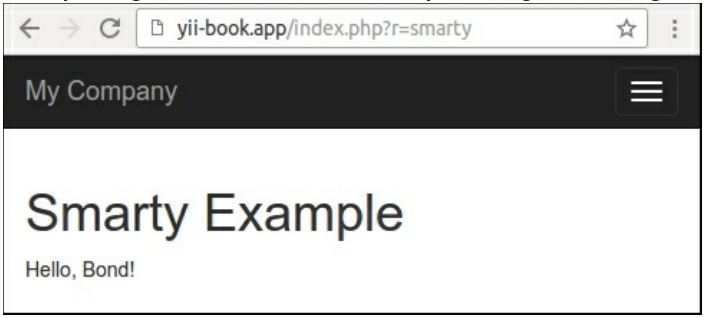

Создание пользовательского средства визуализации представлений
===
Есть много PHP шаблонов двигателей . Yii2 предлагает только собственные шаблоны PHP. Если вы хотите использовать один из существующих движков шаблонов или создать свой собственный, вы должны реализовать его-конечно, если он еще не реализован сообществом Yii.
В этом рецепте мы повторно реализуем поддержку шаблонов Smarty.

Подготовка 
---

1 Создайте новое yii2-app-basic приложение с помощью диспетчера пакетов Composer, как описано в официальном руководстве по адресу <http://www.yiiframework.com/doc-2.0/guide-start-installation.html>. 
По русски <http://yiiframework.domain-na.me/doc/guide/2.0/ru/start-installation>

2 Установите  Smarty library:

***composer require smarty/smarty***

Как это сделать...
---
Выполните следующие действия для создания пользовательского средства визуализации представлений:

1 Создайте файл smarty/ViewRenderer.php:
```php
<?php
namespace app\smarty;
use Smarty;
use Yii;
class ViewRenderer extends \yii\base\ViewRenderer
{
    public $cachePath = '@runtime/smarty/cache';
    public $compilePath = '@runtime/smarty/compile';
    /**
    * @var Smarty
    */
    private $smarty;
    public function init()
    {
        $this->smarty = new Smarty();
        $this->smarty->setCompileDir(Yii::getAlias($this->compilePath));
        $this->smarty->setCacheDir(Yii::getAlias($this->cachePath));
        $this->smarty->setTemplateDir([
            dirname(Yii::$app->getView()->getViewFile()),
            Yii::$app->getViewPath(),
        ]);
    }
    public function render($view, $file, $params)
    {
        $templateParams = empty($params) ? null : $params;
        $template = $this->smarty->createTemplate($file, null, null,$templateParams, false);
        $template->assign('app', \Yii::$app);
        $template->assign('this', $view);
        return $template->fetch();
    }
}
```

2 Теперь нам нужно соединить представление renderers к приложению. В config/web.php нужно добавить представление компонента renderers:
```php
'components' => [
    'view' => [
        'renderers ' => [
            'tpl' => [
                'class' => 'app\smarty\ViewRenderer',
            ],
        ],
    ].
];
```

3 Теперь давайте проверим это. Создание нового SmartyController:
```php
<?php
namespace app\controllers;
use yii\web\Controller;
class SmartyController extends Controller
{
    public function actionIndex()
    {
        return $this->render('index.tpl', [
            'name' => 'Bond ',
        ]);
    }
}
```

4 Далее нам нужно создать views/smarty/index.tpl:
```php
<div class="smarty-index">
    <h1>Smarty Example</h1>
    <p>Hello, {$name}!</p>
</div>
```

5  Теперь попробуйте запустить контроллер. В случае успеха вы должны получить следующие выходные данные:


Как это работает...
---
Средство визуализации представления является дочерним для абстрактного класса yii\base\viewRenderer, реализующего только один метод, называемый render:
```php
<?php
namespace yii\base;
abstract class ViewRenderer extends Component
{
    /**
    * Renders a view file.
    *
    * This method is invoked by [[View]] whenever it tries to render a view.
    * Child classes must implement this method to render the given view file.
    *
    * @param View $view the view object used for rendering the file.
    * @param string $file the view file.
    * @param array $params the parameters to be passed to the view file.
    * @return string the rendering result
    */
    abstract public function render($view, $file, $params);
}
```
Поэтому мы получаем компонент представления, путь к файлу и переменные визуализации. Нужно обработать файл и возвраnbnm готовый результат. В нашем случае сама обработка осуществляется шаблонным движком Smarty, поэтому нам нужно правильно инициализировать его и вызвать его методы обработки:
```php
class ViewRenderer extends \yii\base\ViewRenderer
{
    public $cachePath = '@runtime/smarty/cache';
    public $compilePath = '@runtime/smarty/compile';
    private $smarty;
    public function init()
    {
        $this->smarty = new Smarty();
        $this->smarty->setCompileDir(Yii::getAlias($this->compilePath));
        $this->smarty->setCacheDir(Yii::getAlias($this->cachePath));
        $this->smarty->setTemplateDir([
            dirname(Yii::$app->getView()->getViewFile()),
            Yii::$app->getViewPath(),
        ]);
    }
}
```
Рекомендуется хранить временные файлы Yii в каталоге среды выполнения приложения. Вот почему мы устанавливаем каталог компиляции, где Smarty хранит свои шаблоны, скомпилированные в PHP, в runtime/smarty/compile.
Сам рендеринг немного проще:
```php
public function render($view, $file, $params)
{
    $templateParams = empty($params) ? null : $params;
    $template = $this->smarty->createTemplate($file, null, null, $templateParams, false);
    $template->assign('app', \Yii::$app);
    $template->assign('this', $view);
    return $template->fetch();
}
```
Весь набор данных через $this ->render передается шаблону Smarty как есть. Кроме того, мы создаем специальные переменные шаблона Smarty с именем app, и это указывает на Yii: :$app и Yii: :$app->view и позволяет нам получить свойства приложения внутри шаблона.
Затем мы визуализируем шаблоны.

Смотрите так же
---
Вы можете подготовиться к использованию smarty view renderer с плагинами и поддержкой конфигурации по адресу <https ://githnb.com/yiisoft/yii2-smarty>.

Дополнительные сведения о средствах визуализации Smarty и view в целом см. по следующим URL-адресам:<http://www. smarty.net>
* <http://www.viiframework.com/doc-2.0/guide-tutorial-templateengines.html>
* <http://www.yiiframework.com/doc-2.0/guide-structure-views.html>
по русски  <https://www.yiiframework.com/doc/guide/2.0/ru/structure-views>
