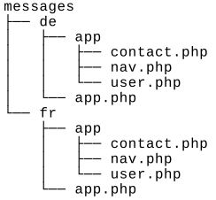
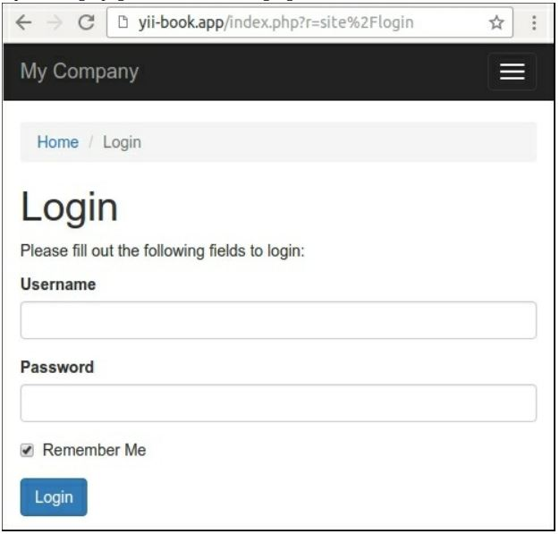
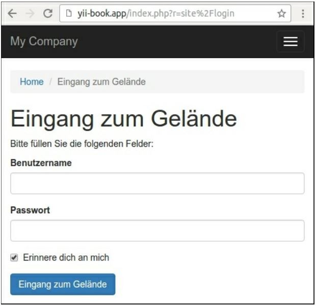
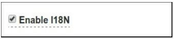

Создание многоязычного приложения
===
С каждым днем мы встречаем все больше международных компаний, программных продуктов и информационных ресурсов, публикующих контент на нескольких языках. Yii2 обеспечивает встроенную поддержку i18n для создания многоязычных приложений.
В этом рецепте мы переводим интерфейс приложения на разные языки.

Подготовка 
---
Создайте новое yii2-app-basic приложение с помощью диспетчера пакетов Composer, как описано в официальном руководстве по адресу <http://www.yiiframework.com/doc-2.0/guide-start-installation.html>. 
По русски <http://yiiframework.domain-na.me/doc/guide/2.0/ru/start-installation>

Как это сделать...
---

1 Изменение основной надписи в меню views/layouts/main.php в файле для использования метода Yii: : t(' app/nav','...'):
```php
echo Nav::widget([
    'options' => ['class' => 'navbar-nav navbar-right'],
    'items' => [
        ['label' => Yii::t('app/nav', 'Home'), 'url' => ['/site/index']],
        ['label' => Yii::t('app/nav', 'About'), 'url' => ['/site/about']],
        ['label' => Yii::t('app/nav', 'Contact'), 'url' => ['/site/contact']],
        ...
    ], 
]);
```

2 Измените все заголовки и хлебные крошки, чтобы использовать метод Yii ::t(' app, '...'):
```php
$this->title = Yii::t('app', 'Contact');
$this->params['breadcrumbs'][] = $this->title;
```

3 Кроме того, измените все метки кнопок:
```php
<div class="form-group">
    <?= Html::submitButton(Yii::t('app', 'Submit'), ['class' => 'btn btn-primary']) ?>
</div>
```
Изменение других жестко закодированных сообщений, а также:
```php
<p>
    <?= Yii::t('app', 'The above error occurred while the Web server was processing your request.') ?>
</p>
```

4 Изменение меток атрибутов модели ContactForm:
```php
class LoginForm extends Model
{
    public function attributeLabels()
    {
        return [
            'username' => Yii::t('app/user', 'Username'),
            'password' => Yii::t('app/user', 'Password'),
            'rememberMe' => Yii::t('app/user', 'Remember Me'),
        ];
    }
}
```
Кроме того, измените метки атрибутов модели LoginForm:
```php
class ContactForm extends Model
{
    public function attributeLabels()
    {
        return [
            'name' => Yii::t('app/contact', 'Name'),
            'email' => Yii::t('app/contact', 'Email'),
            'subject' => Yii::t('app/contact', 'Subject'),
            'body' => Yii::t('app/contact', 'Body'),
            'verifyCode' => Yii::t('app', 'Verification Code'),
        ];
    }
}
```
Он будет выводить переведенные метки для текущего языка вместо оригиналов.


5 Для подготовки переводов создайте каталог Сообщений. Прямо сейчас мы можем создать файлы перевода для всех необходимых языков. Мы можем сделать это вручную, но есть полезный искатель, который может сканировать все файлы проекта и извлекать все сообщения из конструкций Yii ::t (). Давайте использовать его.

6 Создайте файл конфигурации для сканера Сообщений:

***./yii message/config-template config/messages.php***

7 Откройте файл конфигурации и задайте следующие значения:
```php
<?php
return [
    'sourcePath' => '@app',
    'languages' => ['de',	'fr'],
    'translator' => 'Yii::t',
    'sort' => false,
    'removeUnused' => false,
    'markUnused' => true,
    'only' => ['*.php'],
    'except' => [
        '.svn',
        '.git',
        '.gitignore',
        '.gitkeep',
        '.hgignore',
        '.hgkeep',
        '/messages',
        '/vendor',
    ],
    'format' => 'php',
    'messagePath' => '@app/messages',
    'overwrite' => true,
    'ignoreCategories' => [
        'yii',
    ],
];
```

8 Запустите искатель, передавая ему этот файл конфигурации:

***./yii message config/messages.php***

9 После завершения процесса, мы должны получить следующую структуру каталогов:


10 Например, файл messages/de/app/contact содержит следующее содержимое:
```php
<?php...
return [
    'Body' => '',
    'Email' => '',
    'Name' => '',
    'Subject' => '',
];
```
11 Это простой массив PHP с оригинальными предложениями в ключах и переведенными сообщениями в значениях.

12 Просто введите значения, необходимые для перевода сообщений из немецкого:
```php
<?php.
return [
    'Password' => 'Passwort',
    'Remember Me' => 'Erinnere dich an mich',
    'Username' => 'Benutzername',
];
```

13 Прикрепите эти переводы к компоненту ii8n приложения в файле config/web.php:
```php
$config = [
    'id' => 'basic',
    'basePath' => dirname(__DIR__),
    'bootstrap' => ['log'],
    'components' => [
        'i18n' => [
            'translations' => [
                'app*' => [
                    'class' => 'yii\i18n\PhpMessageSource',
                    'sourceLanguage' => 'en-US',
                ],
            ],
        ],
        'db' => require(	DIR	 .	'/db.php'),
    ],
    'params' => $params,
];
```

14 Откройте страницу входа с языком по умолчанию:


15 Переключить язык приложения на de:
```php
$config = [
    'id' => 'basic',
    'language' => 'de',
    'basePath' => dirname(__DIR__),
    'bootstrap' => ['log'],
];
```
Затем обновите страницу входа


16 Встроенные в фреймворк сообщения и ошибки проверки по умолчанию будут переведены автоматически.

Как это работает...
---
Yii2 предоставляет метод yii::t() для перевода сообщений интерфейса через компонент ii8n, который поддерживает различные типы источников. В этом рецепте мы используем yii\ii8n\hpMessageSource, который хранит переведенные сообщения в простых файлах PHP.
Фреймворк не имеет искусственного интеллекта и не переводит сообщения сам по себе. Подготовленные переводы необходимо поместить в файлы или в базу данных и фреймворк, чтобы получить необходимое сообщение из этого источника.
Текущий язык можно задать вручную:
```php
$config = [
    'id' => ' basic',
    ' language' => 'de',
];
```
Вместо настройки языка в файле конфигурации можно переключить язык приложения во время выполнения
```php
Yii::$app->language = 'fr';
```
Например, если язык пользователя хранится в поле lang модели пользователя, можно создать загрузчик языка:
```php
<?php
namespace app\bootstrap;
use yii\base\BootstrapInterface;
class LanguageBootstrap implements BootstrapInterface
{
    public function bootstrap($app)
    {
        if (!$app->user->isGuest) {
            $app->language = $app->user->identity->lang;
        }
    }
}
```
Зарегистрировать этот класс в списке загрузки:
```php
$config = [
    'id' => ' basic',
    'basePath' => dirname(__DIR__),
    'bootstrap' => ['log', 'app'bootstrap\LanguageBoostrap'],
];
```
Теперь каждый аутентифицированный пользователь увидит интерфейс на своем языке.
Кроме того, можно переопределить класс yii\web\UrlManager для передачи текущего языка в качестве параметра GET или префикса URL-адреса. Кроме того, в качестве альтернативы вы можете хранить выбранные языки в файлах cookie браузера.
При создании моделей и другого кода с помощью Gii можно выбрать следующий параметр:


Все метки в сгенерированном коде будут включены в вызовы Yii::t().
***Замечание*** Мы не рассматривали перевод содержания модели в этом рецепте. Однако, например, можно хранить переведенные тексты в отдельных таблицах (например, в таблице post_lang для таблицы post model) в базе данных и использовать значение свойства Yii:: $app - >language для получения текущего языка и извлечения необходимого содержимого для моделей по значению.

Смотрите так же
---
 Для получения дополнительной информации об интернационализации в Yii2, обратитесь к 
<https://www.yiiframework.com/doc/guide/2.0/en/tutorial-i18n>
по русски <https://www.yiiframework.com/doc/guide/2.0/ru/tutorial-i18n> 
