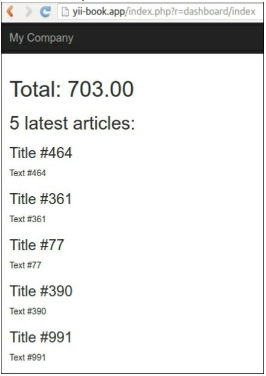
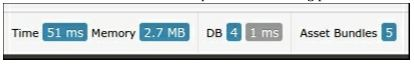
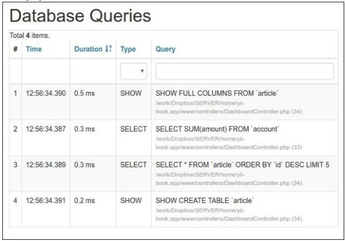

Использование зависимостей кеша и цепочек
===
Yii поддерживает множество серверных частей кэша, но что действительно делает кэш yii гибким, так это поддержка цепочек зависимостей и зависимостей. Существуют ситуации, когда вы не можете просто кэшировать данные в течение часа, потому что кэшированная информация может быть изменена в любое время.
В этом рецепте мы увидим, как кэшировать целую страницу и при этом всегда получать свежие данные при ее обновлении. Страница будет иметь Тип dashboard и покажет пять последних добавленных статей и общее количество, рассчитанное для учетной записи.

***Замечание*** Обратите внимание, что операция не может быть изменена по мере добавления, но статья может быть.

Подготовка 
---
Создайте новое yii2-app-basic приложение с помощью диспетчера пакетов Composer, как описано в официальном руководстве по адресу <http://www.yiiframework.com/doc-2.0/guide-start-installation.html>. 
По русски <http://yiiframework.domain-na.me/doc/guide/2.0/ru/start-installation>


1 Активируйте компонент кэширования в config/web.php следующим образом:
```php
return [
    // ...
    'components' => [
        cache => ['class' => 'yii\caching\FileCache,],
    ],
];
```

2 Настройте новую базу данных и настройте ее в config/db.php.

3 Выполните следующую миграцию:

```php
<?php
use yii\db\Schema;
use yii\db\Migration;
class m160308_093233_create_example_tables extends Migration
{
    public function up()
    {
        $tableOptions = null;
        if ($this->db->driverName === 'mysql') {
            $tableOptions = 'CHARACTER SET utf8 COLLATE utf8_general_ci ENGINE=InnoDB';
        }
        $this->createTable('{{%account}}',[
            'id' => Schema::TYPE_PK,
            'amount' => Schema::TYPE_DECIMAL . '(10,2) NOT NULL',
        ], $tableOptions);
        $this->createTable('{{%article}}',[
            'id' => Schema::TYPE_PK,
            'title' => Schema::TYPE_STRING . ' NOT NULL',
            'text' => Schema::TYPE_TEXT . ' NOT NULL',
        ], $tableOptions);
    }
    public function down()
    {
        $this->dropTable('{{%article}}');
        $this->dropTable('{{%account}}');
    }
}
```

4 Создание моделей для таблиц счетов и статей с помощью Yii.

5 Создайте protected/controllers/DashboardController.php следующим образом:

```php
<?php
namespace app\controllers;
use app\models\Account;
use app\models\Article;
use yii\web\Controller;
class DashboardController extends Controller
{
    public function actionIndex()
    {
        $total = Account::find()->sum('amount');
        $articles = Article::find()->orderBy('id DESC')->limit(5)->all();
        return $this->render('index', array(
            'total' => $total,
            'articles' => $articles,
        ));
    }
    public function actionRandomOperation()
    {
        $rec = new Account();
        $rec->amount = rand(-1000, 1000);
        $rec->save();
        echo 'OK';
    }
    public function actionRandomArticle()
    {
        $n = rand(0, 1000);
        $article = new Article();
        $article->title = "Title #".$n;
        $article->text = "Text #".$n;
        $article->save();
        echo 'OK';
    }
}
```

6 Создание views/dashboard/index.php следующим образом:
```php
<?php
use yii\helpers\Html;
/* @var $this yii\web\View */
/* @var $total int */
/* @var $articles app\models\Article[] */
?>
<h1>Total: <?= $total ?></h1>
<h2>5 latest articles:</h2>
<?php foreach($articles as $article): ?>
    <h3><?= Html::encode($article->title) ?></h3>
    <div><?= Html::encode($article->text) ?></div>
<?php endforeach ?>
```

7 Запустите dashboard/random-operation и dashboard/random-article несколько раз. Потом бежать dashboard/index, и вы должны увидеть экран, подобный показанному на следующем снимке экрана:


8 Нажмите на количество запросов к базе данных в панели отладки в нижней части страницы:


Список запросов :


Как это работает...
---
Для достижения максимальной производительности при минимальном изменении кода мы используем полностраничный кэш с использованием фильтра следующим образом:
```php
public function behaviors()
{
return [
    'pageCache' => [
        'class' => 'yii\filters\PageCache',
        'only' => ['index'],
        'duration' => 24 * 3600 * 365, // 1 year
        'dependency' => [
            'class' => 'yii\caching\ChainedDependency',
            'dependencies' => [
                new TagDependency(['tags' => ['articles']]),
                new DbDependency(['sql' => 'SELECT MAX(id) FROM account'])
            ]
        ],
    ],
];
}
```
Предыдущий код означает, что мы применяем к действию индекса кэш полной страницы. Страница будет кэшироваться в течение года, и кэш будет обновляться при изменении одного из данных зависимостей. Поэтому, в целом, зависимость работает следующим образом:
* Первый запуск получает новые данные, как описано в зависимости, сохраняет их для дальнейшего использования и обновляет кэш
* Он получает свежие данные, как описано в разделе зависимость, получает сохраненные данные, а затем сравнивает их
* Если они равны, он использует кэшированные данные
* В противном случае он обновляет кэш, использует новые данные и сохраняет новые данные зависимостей для дальнейшего использования

В нашем случае используются два типа зависимостей—tag и DB. Зависимость тега помечает данные пользовательским строковым тегом и проверяет его, чтобы решить, нужно ли аннулировать кэш, в то время как зависимость БД использует результат запроса SQL для той же цели.
Вопрос, который у вас сейчас, вероятно,: "почему мы использовали БД для одного случая и теги для другого?” Это хороший вопрос!
Цель использования зависимости БД-заменить тяжелые вычисления и выбрать легкий запрос, который получает как можно меньше данных. Самое лучшее в этом типе зависимостей то, что нам не нужно встраивать какую-либо дополнительную логику в существующий код. В нашем случае мы можем использовать этот тип зависимости для операций с учетной записью, но не можем использовать его для статей, так как содержимое статьи может быть изменено. Поэтому для статей мы устанавливаем глобальный тег с именем article, что в основном означает, что мы можем вручную вызвать следующее, когда мы хотим сделать недействительным общий кэш статей:
```php
TagDependency::invalidate(\Yii::$app->cache, 'articles');
```

Смотрите так же
---
Чтобы узнать больше о кэшировании и использовании зависимостей кэша, обратитесь к
<http://www.yiiframework.com/doc-2.0/guide-caching-overview.html>
По русски <https://www.yiiframework.com/doc/guide/2.0/ru/caching-overview>
