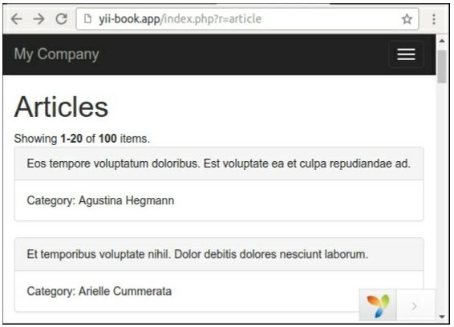
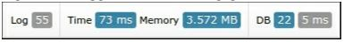
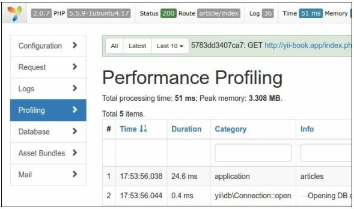

Профилирование приложения с помощью Yii
===
Если все рекомендации по развертыванию приложения Yii применены, а требуемая Производительность по-прежнему отсутствует, то, скорее всего, существуют некоторые узкие места в самом приложении. Основной принцип при работе с этими узкими местами заключается в том, что вы никогда не должны ничего предполагать и всегда тестировать и профилировать код, прежде чем пытаться оптимизировать его.
В этом рецепте мы постараемся найти узкие места в приложении yii2 mini.

Подготовка 
---
Создайте новое yii2-app-basic приложение с помощью диспетчера пакетов Composer, как описано в официальном руководстве по адресу <http://www.yiiframework.com/doc-2.0/guide-start-installation.html>. 
По русски <http://yiiframework.domain-na.me/doc/guide/2.0/ru/start-installation>

1 Настройте подключение к базе данных и примените следующую миграцию:
```php
<?php
use yii\db\Migration;
class m160308_093233_create_example_tables extends Migration
{
    public function up()
    {
        $tableOptions = null;
        if ($this->db->driverName === 'mysql') {
             $tableOptions = 'CHARACTER SET utf8 COLLATE utf8_general_ci ENGINE=InnoDB';
        }
        $this->createTable('{{%category}} ',[
            'id' => $this->primaryKey(),
            'name' => $this->string()->notNull(),
        ], $tableOptions);
        $this->createTable('{{%article}}',[
            'id' => $this->primaryKey(),
            'category_id' => $this->integer()->notNull(),
            'title' => $this->string()->notNull(),
            'text' => $this->text()->notNull(),
        ], $tableOptions);
        $this->createIndex('idx-article-category_id','{{%article}}', ' category_id');
        $this->addForeignKey('fk-article-category_id','{{%article}}', 'category_id', '{{%category}}', 'id');
    }
    public function down()
    {
        $this->dropTable('{{%article}}');
        $this->dropTable('{{%category}}');
    }
}
```

2 Создание моделей для каждой таблицы в Yii.

3 Напишите следующую консольную команду:

```php
<?php
namespace app\commands;
use app\models\Article;
use app\models\Category;
use Faker\Factory;
use yii\console\Controller;
class DataController extends Controller
{
    public function actionInit()
    {
        $db = \Yii::$app->db;
        $faker = Factory::create();
        $transaction = $db->beginTransaction();
        try {
            $categories = [];
            for ($id = 1; $id <= 100; $id++) {
                $categories[] = [
                    'id' => $id,
                    'name' => $faker->name,
                ];
            }
            $db->createCommand()->batchInsert(Category::tableName(), ['id', 'name'], $categories)->execute();
            $articles = [];
            for ($id = 1; $id <= 100; $id++) {
                $articles[] = [
                    'id' => $id,
                    'category_id' => $faker->numberBetween(1, 100),
                    'title' => $faker->text($maxNbChars = 100),
                    'text' => $faker->text($maxNbChars = 200),
                ];
            }
            $db->createCommand()
                ->batchInsert(Article::tableName(), ['id', 'category_id', 'title', 'text'], $articles)->execute();
            $transaction->commit();
        } catch (\Exception $e) {
            $transaction->rollBack();
            throw $e;
        }
    }
}
```
И выполнить её:

***./yii data/init***

4 Добавьте класс ArticleController следующим образом:
```php
<?php
namespace app\controllers;
use Yii;
use app\models\Article;
use yii\data\ActiveDataProvider;
use yii\web\Controller;
class ArticleController extends Controller
{
    public function actionIndex()
    {
        $query = Article::find();
        $dataProvider = new ActiveDataProvider([
            'query' => $query,
        ]);
        return $this->render('index', [
            'dataProvider' => $dataProvider,
        ]);
    }
}
```

5 Добавить вид views/article/index.php посмотреть следующим образом:
```php
<?php
use yii\helpers\Html;
use yii\widgets\ListView;
/* @var $this yii\web\View */
/* @var $dataProvider yii\data\ActiveDataProvider */
$this->title = 'Articles';
$this->params['breadcrumbs'][] = $this->title;
?>
<div class="article-index">
    <h1><?= Html::encode($this->title) ?></h1>
    <?= ListView::widget([
        'dataProvider' => $dataProvider,
        'itemOptions' => ['class' => 'item'],
        'itemView' => '_item',
    ]) ?>
/div>
```
Добавьте  views/article/_item.php:
```php
<?php
use yii\helpers\Html;
/* @var $this yii\web\View */
/* @var $model app\models\Article */
?>
<div class="panel panel-default">
    <div class="panel-heading"><?= Html::encode($model->title); ?></div>
    <div class="panel-body">
        Category: <?= Html::encode($model->category->name) ?>
    </div>
</div>
```

Как это сделать...
---
Выполните следующие действия для профилирования приложения с помощью Yii:
1 Откройте страницу статьи:


2 Откройте views/article/index.php  файл и добавьте вызовов профилировщика до и после виджета Listview:
```php
<div class="article-index">
    <h1><?= Html::encode($this->title) ?></h1>
    <?php Yii::beginProfile('articles') ?>
    <?= ListView::widget([
        'dataProvider' => $dataProvider,
        'itemOptions' => ['class' => 'item'],
        'itemView' => '_item',
    ]) ?>
    <?php Yii::endProfile('articles') ?>
</div>
```
Теперь обновите страницу.


3 Разверните панель отладки в нижней части страницы и нажмите на значок синхронизации (73 мс в нашем случае):

Теперь изучите отчет профилирования
 Мы видим, что наш блок статей занял около 40 миллисекунд.

4 Откройте наш контроллер и добавьте нетерпеливую загрузку для отношения категории статьи следующим образом:
```php
class ArticleController extends Controller
{
    public function actionIndex()
    {
        $query = Article::find()->with('category');
        $dataProvider = new ActiveDataProvider([
            'query' => $query,
        ]);
        return $this->render('index', [
            'dataProvider' => $dataProvider,
        ]);
    }
}
```

5 Вернитесь на сайт, обновите страницу и снова откройте отчет профилирования


Сейчас список статей занимает около 25 миллисекунд, так как приложение делает меньше запросов SQL с нетерпеливой загрузкой связанных моделей.

Как это работает...
---
Любой фрагмент исходного кода можно заключить в вызовы Yii::beginProfile и Yii::endProfile:
```php
Yii::beginProfile('articles');
// ...
Yii::endProfile('articles' );
```
После выполнения страницы Вы можете увидеть отчет со всеми таймингами на странице профилирование модуля отладка.
Кроме того, можно использовать вложенные вызовы профилирования следующим образом:
```php
Yii::beginProfile('outer');
Yii::beginProfile('inner');
// ...
Yii::endProfile('inner');
Yii::endProfile('outer');
```
***Замечания***: Позаботьтесь о правильном открытии и закрытии вызовов в этом случае и правильном именовании блоков. Если вы пропустите метод yii::endProfile звонок или переключить порядок в yii::endProfile( 'inner' ) и yii::endProfile ("outer"), профилирования производительности не получится.

Смотрите так же
---
* Дополнительные сведения о ведении журнала см. в следующей  URL 
<https://www.yiiframework.com/doc/guide/2.0/en/runtime-logging#performance-profiling> 
По русски <https://www.yiiframework.com/doc/guide/2.0/ru/runtime-logging#performance-profiling>
* О настройке производительности приложения см. следующий URL-адрес:
<http://www.yiiframework.com/doc-2.0/guide-tutorial-performance-tuning.html>
по русски <https://www.yiiframework.com/doc/guide/2.0/ru/tutorial-performance-tuning> 
