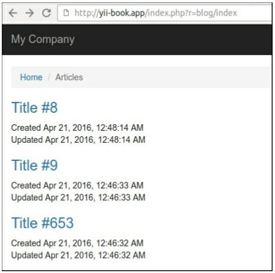
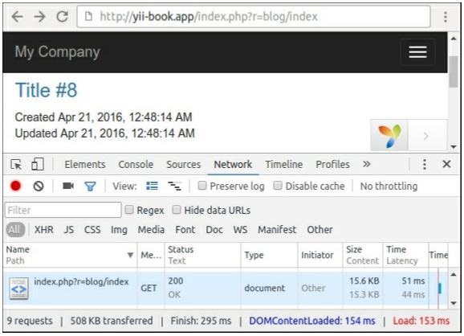
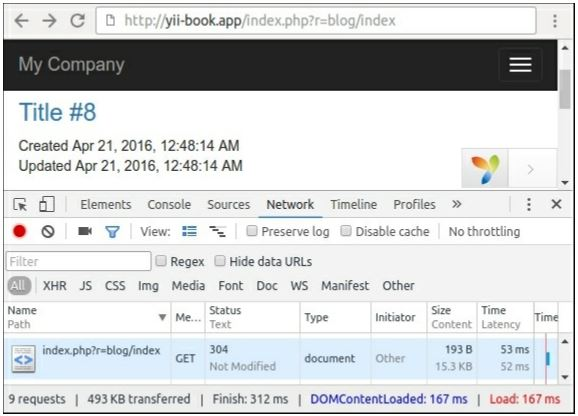
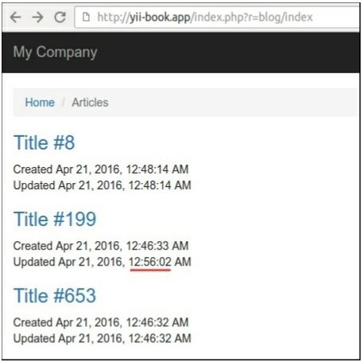
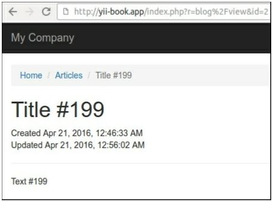
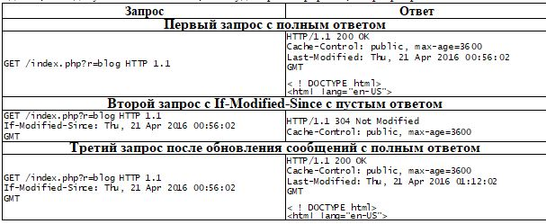
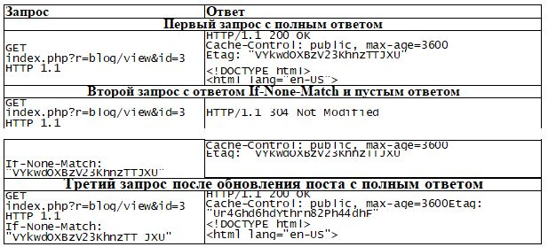

Использование кэширования HTTP
===
Вместо реализации кэширования на стороне сервера можно использовать кэширование на стороне клиента через определенные http-заголовки.
В этом рецепте мы рассмотрим полностраничное кэширование на основе заголовков Last-Modified и ETag.

Подготовка 
---
Создайте новое yii2-app-basic приложение с помощью диспетчера пакетов Composer, как описано в официальном руководстве по адресу <http://www.yiiframework.com/doc-2.0/guide-start-installation.html>. 
По русски <http://yiiframework.domain-na.me/doc/guide/2.0/ru/start-installation>

1 Создайте и запустите миграцию следующим образом:
```php
<?php
use yii\db\Migration;
class m160308_093233_create_example_tables extends Migration
{
    public function up()
    {
        $this->createTable('{{%article}}',[
            'id' => $this->primaryKey(),
            'created_at' => $this->integer()->unsigned()->notNull(),
            'updated_at' => $this->integer()->unsigned()->notNull(),
            'title' => $this->string()->notNull(),
            'text' => $this->text()->notNull(),
        ]);
    }
    public function down()
    {
        $this->dropTable('{{%article}}');
    }
}
```

2 Создайте модель Article следующим образом:
```php
<?php
namespace app\models;
use Yii;
use yii\behaviors\TimestampBehavior;
use yii\db\ActiveRecord;
class Article extends ActiveRecord
{
    public static function tableName()
    {
        return '{{%article}}';
    }
    public function behaviors()
    {
        return [
            TimestampBehavior::className(),
        ];
    }
}
```

3 Создайте контроллер блога со следующими действиями:
```php
<?php
namespace app\controllers;
use app\models\Article;
use yii\web\Controller;
use yii\web\NotFoundHttpException;
class BlogController extends Controller
{
    public function actionIndex()
    {
        $articles = Article::find()->orderBy(['id' => SORT_DESC])->all();
        return $this->render('index', array(
            'articles' => $articles,
        ));
    }
    public function actionView($id)
    {
        $article = $this->findModel($id);
        return $this->render('view', array(
            'article' => $article,
        ));
    }
    public function actionCreate()
    {
        $n = rand(0, 1000);
        $article = new Article();
        $article->title = 'Title #'	. $n;
        $article->text = 'Text #'	. $n;
        $article->save();
        echo 'OK';
    }
    public function actionUpdate($id)
    {
        $article = $this->findModel($id);
        $n = rand(0, 1000);
        $article->title = 'Title #'	. $n;
        $article->text = 'Text #'	. $n;
        $article->save();
        echo 'OK';
    }
    private function findModel($id)
    {
        if (($model = Article::findOne($id)) !== null) {
            return $model;
        } else {
            throw new NotFoundHttpException('The requested page does not exist.');
        }
    }
}
```

4 Добавьте представления views/blog/index.php:
```php
<?php
use yii\helpers\Html;
$this->title = 'Articles';;
$this->params['breadcrumbs'][] = $this->title;
?>
<?php foreach($articles as $article): ?>
    <h3><?= Html::a(Html::encode($article->title), ['view', 'id' => $article->id])?></h3>
    <div>Created <?= Yii::$app->formatter->asDatetime($article->created_at) ?></div>
    <div>Updated <?= Yii::$app->formatter->asDatetime($article->updated_at) ?></div>
<?php endforeach ?>
```

5 Добавить файл представления views/blog/view.php:
```php
<?php
use yii\helpers\Html;
$this->title = $article->title;
$this->params['breadcrumbs'][] = ['label' => 'Articles', 'url' => ['index']];
$this->params['breadcrumbs'][] = $this->title;
?>
<h1><?= Html::encode($article->title) ?></h1>
<div>Created <?= Yii::$app->formatter->asDatetime($article->created_at) ?></div>
<div>Updated <?= Yii::$app->formatter->asDatetime($article->updated_at) ?></div>
<hr />
<p><?= Yii::$app->formatter->asNtext($article->text) ?></p>
```

Как это сделать...
---
Выполните следующие действия, чтобы использовать кэширование HTTP:

1 Доступ к этому URL http://yii-book.app/index.РНР?р=blog/create три раза, чтобы создать три статьи.

2 Откройте следующую страницу блога:


3 Откройте консоль разработчика в браузере и просмотрите состояние ответа 200 OK для каждой перезагрузки страницы блога:


4 Откройте BlogController и присоедините следующие поведения:
```php
class BlogController extends Controller
{
    public function behaviors()
    {
        return [
            [
                'class' => 'yii\filters\HttpCache',
                'only' => ['index'],
                'lastModified' => function ($action, $params) {
                    return Article::find()->max('updated_at');
                },
            ],
            [
                'class' => 'yii\filters\HttpCache',
                'only' => ['view'],
                'etagSeed' => function ($action, $params) {
                    $article = $this->findModel(\Yii::$app->request->get('id'));
                    return serialize([$article->title, $article->text]);
                },
            ],
        ];
    }
    // ...
}
```

5 Затем перезагрузите страницу несколько раз и убедитесь, что сервер возвращает состояние 304 Not Modified вместо 200 OK:


6 Откройте соответствующую страницу, используя следующий URL-Адрес для обновления случайных статей: http://yii-book.app/index.php?r=blog/update.

7 После обновления страницы блога, убедитесь, что сервер возвращает 200 OK в первый раз и 304 не изменяется после этого, и убедитесь, что вы видите новое обновленное время на странице:


8 Откройте любую страницу из нашей статьи следующим образом:


Убедитесь, что сервер возвращает 200 OK в первый раз и 304 не изменяется при последующих запросах.

Как это работает...
---
Есть время и содержание подходов для проверки наличия кэшируемого Контента ответ на Ваш браузер с помощью http-заголовки.

***Последнее Изменение***

Этот подход предполагает, что сервер должен возвращать дату последнего изменения каждого документа. После сохранения даты, наш браузер может прикрепить ее в заголовке If-Modified-Since для каждого последующего запроса.
Мы должны прикрепить фильтр действий к нашему контроллеру и указать lastModified обратный вызов следующим образом:
```php
class BlogController extends Controller
{
    public function behaviors()
    {
        return [
            [
                'class' => 'yii\filters\HttpCache',
                'only' => ['index'],
                'lastModified' => function ($action, $params) {
                    return Article::find()->max('updated_at');
                },
                // ...
            ];
    }
    // ...
}
```
Класс \yii\filters\HttpCache вызывает обратный вызов и сравнивает возвращаемое значение с системной переменной $_SERVER ['HTTP_IF_MODIFIED_SINCE']. Если документ все еще не изменен, HttpCache отправит облегченный Заголовок ответа 304 без выполнения действия.
Однако, если документ был обновлен, кэш будет проигнорирован, и сервер вернет полный ответ.



В качестве альтернативы или дополнения к последней измененной переменной заголовка можно использовать ETag.

***Метка объекта***

В случаях, когда мы не храним дату последнего изменения в наших документах или страницах, мы можем использовать пользовательские хэши, которые могут быть созданы на основе содержимого документа.
Например, мы можем использовать Контент Заголовок документа, чтобы хэш-тэгом:
```php
class BlogController extends Controller
{
    public function behaviors()
    {
        return [
            [
                'class' => 'yii\filters\HttpCache',
                'only' => ['view'],
                'etagSeed' => function ($action, $params) {
                    $article = $this->findModel(\Yii::$app->request->get('id'));
                    return serialize([$article->title, $article->text]);
                },
            ],
        ];
    }
    // ...
}
```
Фильтр HttpCache присоединит этот тег к ответу сервера в качестве переменной заголовка ETag.
После сохранения ETag наш браузер может присоединять его в заголовке If-None-Match для каждого последующего запроса.
Если документ все еще не изменился, HttpCache отправит облегченный Заголовок ответа 304 без выполнения действия.


Когда кэш является допустимым, наше приложение будет отправлять 304 не измененные HTTP-заголовки ответа вместо содержимого страницы и не будет запускать контроллеры и действия повторно.

Смотрите так же
---
* Для получения дополнительной информации о кэшировании HTTP обратитесь к
<https://developers.google.com/web/fundamentals/performanre/optimi7ing-content-efficiency/http-caching>
* По HTTP-caching в Yii2 смотрите инфу по ссылке <http://www.yiiframework.com/doc-2.0/guide-caching-http.html>
 по русски <https://www.yiiframework.com/doc/guide/2.0/ru/caching-http> 
