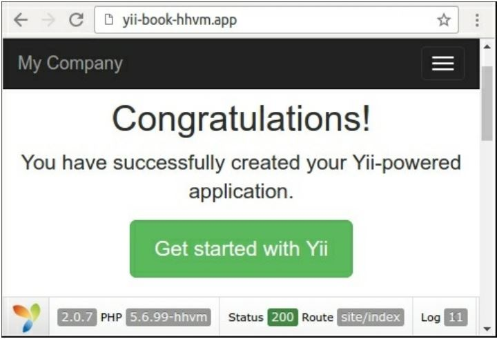

Запуск Yii2 на HHVM
===
HipHop Virtual Machine (HHVM)-это виртуальная машина процесса от Facebook на основе jit-компиляции. HHVM преобразует PHP-код в промежуточный байт-код HipHop (HHBC) и динамически преобразует PHP-код в машинный код, который будет оптимизирован и выполнен в собственном коде.

Подготовка 
---
Создайте новое yii2-app-basic приложение с помощью диспетчера пакетов Composer, как описано в официальном руководстве по адресу <http://www.yiiframework.com/doc-2.0/guide-start-installation.html>. 
По русски <http://yiiframework.domain-na.me/doc/guide/2.0/ru/start-installation>

Как это сделать...
---

1 Установка веб-сервера Apache2 или Nginx.

2 Следуйте инструкциям по установке HHVM на Linux или Mac, доступным по адресу <https://docs.hhvm.com/hhvm/installation/introduction>. Например, на Ubuntu необходимо запустить выполнить следующую команду:
```php
sudo apt-get install software-properties-common
sudo apt-key adv --recv-keys --keyserver hkp://keyserver.ubuntu.com:80
0x5a16e7281be7a449
sudo add-apt-repository "deb http://dl.hhvm.com/ubuntu $(lsb_release -sc) main"
sudo apt-get update
sudo apt-get install hhvm
After installing, you will see the following tips in your terminal:
********************************************************************
* HHVM is installed.
*
* Running PHP web scripts with HHVM is done by having your
* webserver talk to HHVM over FastCGI. Install nginx or Apache,
* and then:
* $ sudo /usr/share/hhvm/install_fastcgi.sh
* $ sudo /etc/init.d/hhvm restart
*  (if using nginx) $ sudo /etc/init.d/nginx restart
*  (if using apache) $ sudo /etc/init.d/apache restart
*
* Detailed FastCGI directions are online at:
* https://github.com/facebook/hhvm/wiki/FastCGI
*
* If you're using HHVM to run web scripts, you probably want it
* to start at boot:
* $ sudo update-rc.d hhvm defaults
*
* Running command-line scripts with HHVM requires no special setup:
* $ hhvm whatever.php
*
* You can use HHVM for /usr/bin/php even if you have php-cli
* installed:
* $ sudo /usr/bin/update-alternatives \
* --install /usr/bin/php php /usr/bin/hhvm 60

```

3 Попробуйте запустить встроенный сервер вручную для вашего сайта:
```php
cd web
hhvm -m server -p 8080
```
Откройте  localhost: 8080 в вашем браузере:


Прямо сейчас вы можете использовать HHVM для разработки вашего проекта.

4 Если вы используете сервер Nginx или Apache2, то HHVM автоматически создает собственные файлы конфигурации в каталогах /etc/nginx и /etc/apache2. В случае Nginx он создает /etc/nginx/hhvm.conf шаблон для включения конфигурационного файла в ваши проекты. Например, давайте создадим новый виртуальный хост с именем yii-book-hhvm.app:
```php
server {
    listen 127.0.0.1:80;
    server_name .yii-book-hhvm.app;
    root /var/www/yii-book-hhvm.app/web;
    charset utf-8;
    index index.php index.html index.htm;
    include /etc/nginx/hhvm.conf;
}
```
Добавьте имя хоста в ваш /etc/hosts:

***127.0.0.1 yii-book-hhvm.app***

Теперь перезапустите сервер Nginx:

***sudo service nginx restart***

Наконец, откройте новый хост в вашем браузере


Ваш сервер настроен правильно.

Как это работает...
---
Вы можете использовать HHVM в качестве альтернативного процесса PHP в режиме fastcgi. По умолчанию слушает порт 9000. Вы можете изменить порт по умолчанию процесса fastcgi в файле /etc/hhvm/server.ini:

***hhvm.server.port = 9000***

Настройте конкретные параметры PHP в файле/etc/hhvm/php.ini файле.

Смотрите так же
---
Дополнительные сведения об установке HHVM см. по следующим URL-адресам:
* <https://docs.hhvm.com/hhvm/installation/linux>
* <https://docs.hhvm.com/hhvm/installation/mac>
* Для получения дополнительной информации об использовании HHVM обратитесь к <https://docs.hhvm.com/hhvm/>.
