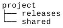
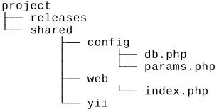
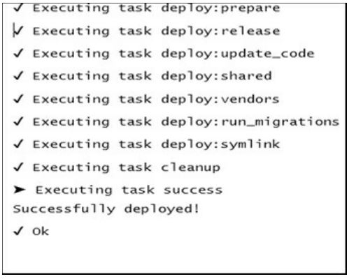
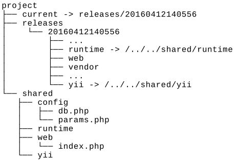

Средства развертывания
==
Если вы используете систему управления версиями, такую как Git, для кода вашего проекта и отправки релизов в удаленный репозиторий, Вы можете использовать Git для развертывания кода на рабочем сервере с помощью команды git pull shell вместо загрузки файлов вручную. Кроме того, вы можете написать свой собственный сценарий оболочки, чтобы вытащить новые фиксации репозитория, обновить поставщиков, применить миграции и сделать больше вещей.
Однако существует множество инструментов для автоматизации процесса развертывания. В этом рецепте мы рассмотрим инструмент Deployer.

Подготовка 
--
Создайте новое yii2-app-basic приложение с помощью диспетчера пакетов Composer, как описано в официальном руководстве по адресу <http://www.yiiframework.com/doc-2.0/guide-start-installation.html>. 
По русски <http://yiiframework.domain-na.me/doc/guide/2.0/ru/start-installation>

Как это сделать...
---
При наличии общего удаленного хранилища его можно использовать для источника развертывания.

***Шаг 1-Подготовка удаленного хоста***

1 Перейдите на удаленный хост и установите Composer и asset-plugin:

***global require 'fxp/composer-asset-plugin:~1.1.1'***

2 Сгенерируйте ключ SSH через ssh-keygen.

3 Добавить содержимое ~/.ssh/id_rsa.pub  pub-файла в развертывание страница SSH-ключей настроек репозитория на github, Bitbucket или другом хранилище репозиториев.

4 Попробуйте клонировать репозиторий вручную:

***git clone git@github.com:user/repo.git***

5 Добавьте адрес Github в список известных хостов, если система попросит вас сделать это.

***Шаг 2-Подготовка localhost***

1 Установите deploy.phar глобально на локальном компьютере:
```php
sudo wget http://deployer.org/deployer.phar
sudo mv deployer.phar /usr/local/bin/dep
sudo chmod +x /usr/local/bin/dep
```

2 Добавьте deploy.php файл с конфигурацией развертывания:
```php
<?php
require 'recipe/yii2-app-basic.php';
set('shared_files', [
    ' config/db.php',
    'config/params.php',
    'web/index.php ',
    ' yii',
]);
server('prod', 'site.com', 22) // SSH access to remote server
    ->user( ' user' )
    // ->password(password) // uncomment for authentication by password
    // ->identityFile()	// uncomment for authentication by SSH key
    ->stage('production')
    ->env('deploy_path',	'/var/www/project');
set('repository', 'git@github.com:user/repo.git');
```

3 Попробуйте подготовить структуру каталогов удаленных проектов:

***dep deploy:prepare prod***

***Шаг 3-Добавление удаленной конфигурации***

1 Откройте каталог сервера /var/www/project. Он имеет два подкаталога после инициализации:


2 Создание исходных файлов с частными конфигурациями в общем каталоге, как здесь:


Инструмент Deployer будет включать эти файлы в каждый подкаталог release через символические ссылки. Укажите свою личную конфигурацию в файле share/config/db.php:
```php
<?php
return [
    'class' => 'yii\db\Connection',
    dsn' => 'mysql:host=localhost;dbname=catalog',
    'username' => 'root',
    'password' => 'root',
    ' charset' => 'utf8',
];
```
Кроме того, укажите его в share/config/params.php:
```php
<?php
return [
    'adminEmail' => 'admin@example.com',
];
```
Установите содержимое share/web/index.php:
```php
<?php
defined('YII_DEBUG') or define('YII_DEBUG', false);
defined('YII_ENV') or define('YII_ENV', 'prod');
$dir = dirname($_SERVER['SCRIPT_FILENAME']);
require($dir . '/../vendor/autoload.php');
require($dir . '/../vendor/yiisoft/yii2/Yii.php');
$config = require($dir . '/../config/web.php');
(new yii\web\Application($config))->run();
```
Кроме того, установите содержимое файла share/yii:
```php
#!/usr/bin/env php
<?php
defined('YII_DEBUG') or define('YII_DEBUG', false);
defined('YII_ENV') or define('YII_ENV', 'prod');
$dir = dirname($_SERVER['SCRIPT_FILENAME']);
require($dir . '/vendor/autoload.php');
require($dir . '/vendor/yiisoft/yii2/Yii.php');
$config = require($dir. '/config/console.php');
$application = new yii\console\Application($config);
$exitCode = $application->run();
exit($exitCode);
```
***Замечание*** Мы намеренно используем код dirname($_SERVER [' SCRIPT_FILENAME ' ]) вместо исходной константы__ DIR__, потому что _ _ DIR _ _ вернет неверное значение, когда файл будет включен через символьную ссылку.

***Замечание:*** При использовании шаблона yii2-app-advanced можно повторно объявить только config/main-local.php и config/params-local.php файлы каждого (backend, frontend, console и common), потому что web/index.php и yii файлы будут созданы автоматически командой init.

***Шаг 4-попытка развертывания***

1 Вернуться к localhost с deploy.php файл и выполнить команду deploy:

***dep deploy prod***

2 В случае успеха, вы увидите отчет о развертывании:


3 Deployer создал новый подкаталог release на удаленном сервере и добавил символические ссылки из проекта на общие элементы и из текущего каталога в текущий выпуск:


4 После того, как все будет сделано, вы должны настроить DocumentRoot директорию  вашего сервера в project/current/web.

5 Если в процессе развертывания что-то пойдет не так, можно выполнить откат к предыдущему рабочему выпуску:

***dep rollback prod***

Текущий каталог приведет к предыдущим файлам выпуска.

Как это работает...
---
Большинство средств развертывания выполняют те же задачи:
* Создать новый подкаталог релиза 
* Клонирование файлов репозитория
* Создание символических ссылок из проекта на общие каталоги и локальные файлы конфигурации
* Установка пакетов Composer
* Применение миграции проектов
* Переключите символическую ссылку из каталога DocumentRoot сервера в каталог текущего выпуска
Инструмент Deployer содержит предопределенные рецепты популярных фреймворков. Вы можете расширить любой существующий рецепт или написать новый для вашего конкретного случая.

Смотрите так же
---
* Дополнительные сведения о Deployer см. в разделе <http://deployer.org/docs>
* И о создании ключей SSH см. <https://git-scm.com/book/en/v2/Git-on-the-Server-Generating-Your-SSH-Public-Key> 
