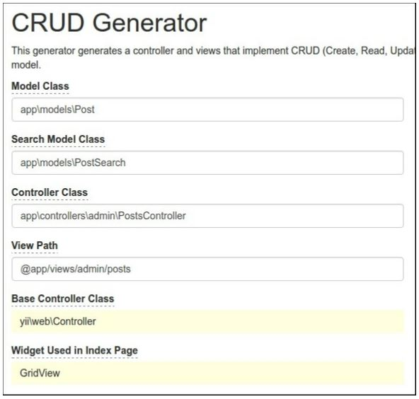
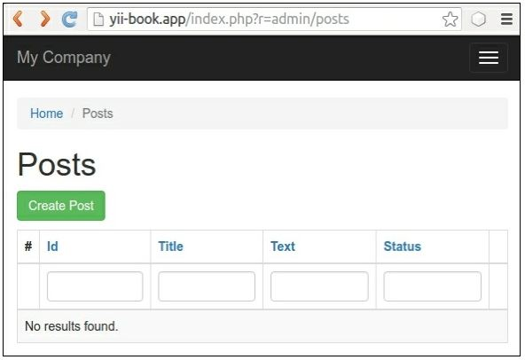
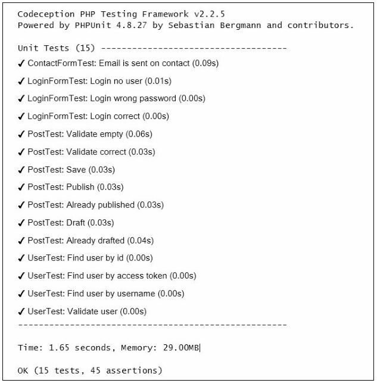
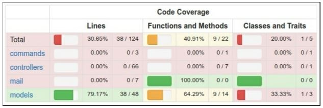
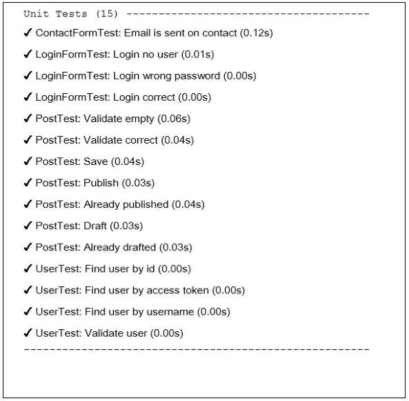
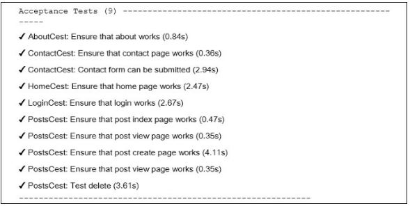
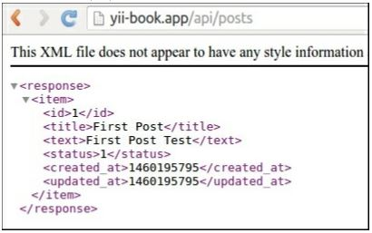
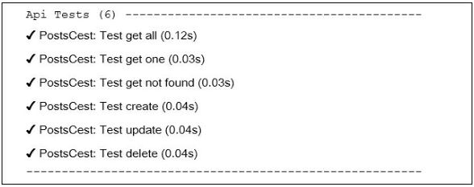

Тестирование приложения с Codeception
===
По умолчанию базовые и расширенные скелеты приложений Yii2 используют Codeception в качестве платформы тестирования. Codeception поддерживает написание модульных, функциональных и приемочных тестов из коробки. Для модульных тестов используется Платформа тестирования PHPUnit, которая будет описана в следующем рецепте.

Подготовка 
---

1 Создайте новое yii2-app-basic приложение с помощью диспетчера пакетов Composer, как описано в официальном руководстве по адресу <http://www.yiiframework.com/doc-2.0/guide-start-installation.html>. 
По русски http://yiiframework.domain-na.me/doc/guide/2.0/ru/start-installation

***Замечание***: Если вы используете версию 2.0.9 (или более раннюю) базового приложения, просто обновите вручную каталог тестов, а также добавьте config/test.php.в , config/test_db.php и web/index-тест.php-файл. Кроме того, вы должны скопировать разделы require и require-dev composer.json-файл и запустить

***composer update.***

2 Создайте и примените следующую миграцию:
```php
<?php
use yii\db\Migration;
class m160309_070856_create_post extends Migration
{
    public function up()
    {
        $this->createTable('{{%post}}',	[
            'id' => $this->primaryKey(),
            'title' => $this->string()->notNull(),
            'text' => $this->text()->notNull(),
            'status' => $this->smallInteger()->notNull()-
            >defaultValue(0),
        ]);
    }
    public function down()
    {
        $this->dropTable('{{%post}}');
    }
}
```

3 Создать модель Post:
```php
namespace app\models;
use Yii;
use yii\db\ActiveRecord;
/**
* @property integer $id
* @property string $title
* @property string $text
* @property integer $status
* @property integer $created_at
* @property integer $updated_at
*/
class Post extends ActiveRecord
{
    const STATUS_DRAFT = 0;
    const STATUS_ACTIVE = 1;
    public static function tableName()
    {
        return '{{%post}}';
    }
    public function rules()
    {
        return [
            [['title', 'text'], 'required'],
            [[' text'],	'string'],
            ['status', 'in', 'range' => [self::STATUS_DRAFT, self::STATUS_ACTIVE]],
            ['status', 'default', 'value' => self::STATUS_DRAFT],
            [['title'], 'string', 'max' => 255],
        ];
    }
    public function behaviors()
    {
        return [
            TimestampBehavior::className(),
        ];
    }
    public static function getStatusList()
    {
        return [
            self::STATUS_DRAFT => 'Draft',
            self::STATUS_ACTIVE => 'Active',
        ];
    }
    public function publish()
    {
        if ($this->status == self::STATUS_ACTIVE) {
            throw new \DomainException('Post is already published.');
        }
        $this->status = self::STATUS_ACTIVE;
    }
    public function draft()
    {
        if ($this->status == self::STATUS_DRAFT) {
        throw new \DomainException('Post is already drafted.');
        }
        $this->status = self::STATUS_DRAFT;
    }
}
```

4 Сгенерируйте CRUD:


5 Кроме того, добавьте раскрывающийся список состояние для поля состояние и имя для кнопки Отправить в  views/admin/posts/_form.php:
```php
<div class="post-form">
    <?php $form = ActiveForm::begin(); ?>
        <?= $form->field($model, 'title')->textInput(['maxlength' => true]) ?>
        <?= $form->field($model, 'text')->textarea(['rows' => 6]) ?>
        <?= $form->field($model, 'status')->dropDownList(Post::getStatusList()) ?>
        <div class="form-group">
            <?= Html::submitButton($model->isNewRecord ? 'Create' : 'Update', [
                'class' => $model->isNewRecord ? 'btn btn-success' : 'btn btn-primary',
                'name' => 'submit-button',
            ]) ?>
        </div>
    <?php ActiveForm::end(); ?>
</div>
```

6 Теперь проверьте, что контроллер работает:


Создайте демо-записи.

Как это сделать...
---
***Подготовка к испытаниям***

Выполните следующие действия, чтобы подготовиться к тестам:

1 Создайте yii2_basic_tests или другую тестовую базу данных и обновите ее, применив миграции:

***tests/bin/yii migrate***

Команда должна быть запущена в каталоге тестов. Параметры тестовой базы данных можно указать в файле конфигурации  /config/test_db.php.

2 Codeception использует автогенерируемые классы актеров для собственных тестов. Создайте их с помощью этой команды:

***composer exec codecept build***

***Выполнение модульных и функциональных тестов***

Мы можем запускать любые типы тестов приложения прямо сейчас:
```php
# run all available tests
composer exec codecept run
# run functional tests
composer exec codecept run functional
# run unit tests
composer exec codecept run unit
```
В результате, вы можете осмотреть, отчет по испытаниям как этот:


***Получение отчетов о покрытии***

Можно получить отчеты о покрытии кода для кода. По умолчанию покрытие кода отключено в конфигурации tests/codeception.yml; вы должны раскомментировать необходимые строки, чтобы иметь возможность собирать покрытие кода:
```php
coverage:
    enabled: true
    whitelist:
        include:
            - models/*
            - controllers/*
            - commands/*
            - mail/*
    blacklist:
        include:
            - assets/*
            - config/*
            - runtime/*
            - vendor/*
            - views/*
            - web/*
            - tests/*
```
Необходимо установить расширение PHP Xdebug с https://xdebug.org. Например, в Ubuntu или Debian вы можете ввести в терминал следующее:

***sudo apt-get install php5-xdebug***

В Windows необходимо открыть php.ini-файл и добавьте пользовательский код с путем к каталогу установки PHP:
```php
[xdebug]
zend_extension_ts=C:/php/ext/php_xdebug.dll
```
Кроме того, если вы используете не потокобезопасный выпуск, введите следующую команду:
```php
[xdebug]
zend_extension=C:/php/ext/php_xdebug.dll
```
Наконец, можно выполнить тесты и собрать отчет о покрытии с помощью следующей команды:
```php
#collect coverage for all tests
composer exec codecept run --coverage-html

#collect coverage only for unit tests
composer exec codecept run unit --coverage-html

#collect coverage for unit and functional tests
composer exec codecept run functional,unit --coverage-html
```
Вы можете увидеть выход покрытия текстового кода в терминале:
```php
Code Coverage Report:
2016-03-31 08:13:05
Summary:
Classes: 20.00% (1/5)
Methods: 40.91% (9/22)
Lines:	30.65% (38/124)
\app\models::ContactForm
Methods:	33.33% ( 1/ 3) Lines: 80.00% ( 12/ 15)
\app\models::LoginForm
Methods: 100.00% ( 4/ 4) Lines: 100.00% ( 18/ 18)
\app\models::User
Methods:	57.14% ( 4/ 7) Lines: 53.33% (	8/ 15)
Remote CodeCoverage reports are not printed to console
HTML report generated in coverage
```
Кроме того, вы можете видеть HTML-отчет в каталоге /tests/codeception/_output/coverage:



Вы можете нажать на любой класс и проанализировать, какие строки кода не были выполнены в процессе тестирования.

***Выполнение приемочных испытаний***

В приемочных тестах можно использовать PhpBrowser для запроса сервера через Curl. Это помогает проверить контроллеры сайта и проанализировать коды ответов HTTP и HTML. Но если вы хотите проверить поведение CSS или JavaScript, вы должны использовать реальный браузер.
Selenium Server-это интерактивный инструмент, который интегрируется в Firefox и другие браузеры и позволяет открывать страницы сайта и эмулировать действия человека.
Для работы с реальным браузером необходимо установить Selenium Server:

1 Требуется полный пакет Codeception вместо базового:
```php
composer require --dev codeception/codeception
composer remove --dev codeception/base
```

2 Скачать следующее программное обеспечение:
* Установите браузер Mozilla Firefox с https://www.mozilla.org
* Установка среды выполнения Java из https://www.java.com/en/download/
* Скачать Selenium Standalone Server с http://www.seleniumhq.org/download/
* Скачать Geckodriver с https://github.com/mozilla/geckodriver/releases

3 Запустить сервер с драйвером в новом окне терминала:
```php
java -jar -Dwebdriver.gecko.driver=~/geckodriver ~/selenium-server-standalone-x.xx.x.jar
```

4 Скопировать tests/acceptance.suite.yml.example в tests/acceptance.suite.yml -файл и настроить как здесь описано:
```php
class_name: AcceptanceTester
modules:
    enabled:
        - WebDriver:
            url: http://127.0.0.1:8080/
            browser: firefox
        - Yii2:
            part: orm
            entryScript: index-test.php
            cleanup: false
```
5 Открыть новый окно терминала и запустите веб-сервер:

***tests/bin/yii serve***

6 Выполнение приемочных тестов:

***composer exec codecept run acceptance***

И вы должны увидеть, как Selenium запускает браузер и проверить все страницы сайта.

***Создание базы данных fixtures***

Перед выполнением собственных тестов необходимо очистить собственную тестовую базу данных и загрузить в нее определенные тестовые данные. Расширение yii2-codeception предоставляет базовый класс ActiveFixture для создания наборов тестовых данных для собственных моделей. Выполните следующие действия для создания креплений базы данных:

1 Создание класса fixture для модели Post:
```php
<?php
namespace tests\fixtures;
use yii\test\ActiveFixture;
class PostFixture extends ActiveFixture
{
public $modelClass = 'app\modules\Post';
public $dataFile = '@tests/_data/post.php';
}
```
2 Добавьте демонстрационный набор данных в файл test/_data/post.php:
```php
<?php
return [
    [
        'id' => 1,
        'title' => 'First Post',
        'text' => 'First Post Text',
        'status' => 1,
        'created_at' => 1457211600,
        'updated_at' => 1457211600,
    ],
    [
        'id' => 2,
        'title' => 'Old Title For Updating',
        'text' => 'Old Text For Updating',
        'status' => 1,
        'created_at' => 1457211600,
        'updated_at' => 1457211600,
    ],
    [
        'id' => 3,
        'title' => 'Title For Deleting',
        'text' => 'Text For Deleting',
        'status' => 1,
        'created_at' => 1457211600,
        'updated_at' => 1457211600,
    ],
];
```

3 Активируйте поддержку fixtures для модульных и приемочных испытаний. Просто добавить fixtures в файл unit.suite.yml:
```php
class_name: UnitTester
    modules:
        enabled:
            - Asserts
            - Yii2:
        part: [orm, fixtures, email]
```
Также, добавьте часть fixtures в acceptance.suite.yml:
```php
class_name: AcceptanceTester
    modules:
        enabled:
            - WebDriver:
                url: http://127.0.0.1:8080/
                browser: firefox
            - Yii2:
                part: [orm, fixtures]
                entryScript: index-test.php
                cleanup: false
```
4 Повторно создайте классы тестера для применения этих изменений с помощью следующей команды:

***composer exec codecept build***

***Написание юнит и интеграционные тесты***

Модульные и интеграционные тесты проверяют исходный код нашего проекта.
Модульные тесты проверяют только текущий класс или его метод в изоляции от других классов и ресурсов, таких как базы данных, файлы и многое другое.
Интеграционные тесты проверяют работу ваших классов в интеграции с другими классами и ресурсами.
Модели ActiveRecord в Yii2 всегда используют базы данных для загрузки схемы таблицы, так как мы должны создать реальную тестовую базу данных, и наши тесты будут интеграционными.

1 Написать тесты для проверки валидации модели, сохранения и изменения ее статуса:
```php
<?php
namespace tests\unit\models;
use app\models\Post;
use Codeception\Test\Unit;
use tests\fixtures\PostFixture;
class PostTest extends Unit
{
    /**
    * @var \UnitTester
    */
    protected $tester;
    public function _before()
    {
        $this->tester->haveFixtures([
            'post' => [
                'class' => PostFixture::className(),
                'dataFile' => codecept_data_dir() . 'post.php'
            ]
        ]);
    }
    public function testValidateEmpty()
    {
        $model = new Post();
        expect('model should not validate', $model->validate())->false();
        expect('title has error', $model->errors)->hasKey('title');
        expect('title has error', $model->errors)->hasKey('text');
    }
    public function testValidateCorrect()
    {
        $model = new Post([
            'title' => 'Other Post',
            'text' => 'Other Post Text',
        ]);
        expect('model should validate', $model->validate())->true();
    }
    public function testSave()
    {
        $model = new Post([
            'title' => 'Test Post',
            'text' => 'Test Post Text',
        ]);
        expect('model should save', $model->save())->true();
        expect('title is correct', $model->title)->equals('Test Post');
        expect('text is correct', $model->text)->equals('Test Post Text');
        expect('status is draft', $model->status)->equals(Post::STATUS_DRAFT);
        expect('created_at is generated', $model->created_at)->notEmpty();
        expect('updated_at is generated', $model->updated_at)->notEmpty();
    }
    public function testPublish()
    {
        $model = new Post(['status' => Post::STATUS_DRAFT]);
        expect('post is drafted', $model->status)->equals(Post::STATUS_DRAFT);
        $model->publish();
        expect('post is published', $model->status)->equals(Post::STATUS_ACTIVE);
    }
    public function testAlreadyPublished()
    {
        $model = new Post(['status' => Post::STATUS_ACTIVE]);
        $this->setExpectedException('\LogicException');
        $model->publish();
    }
    public function testDraft()
    {
        $model = new Post(['status' => Post::STATUS_ACTIVE]);
        expect('post is published', $model->status)->equals(Post::STATUS_ACTIVE);
        $model->draft();
        expect('post is drafted', $model->status)->equals(Post::STATUS_DRAFT);
    }
    public function testAlreadyDrafted()
    {
        $model = new Post(['status' => Post::STATUS_ACTIVE]);
        $this->setExpectedException('\LogicException');
        $model->publish();
    }
}
```

2 Запуск тестов:

***composer exec codecept run unit***

3 Теперь увидим результат:


Вот и все. Если вы намеренно или случайно нарушите метод любой модели, вы увидите сломанный тест.

***Написание функционального теста***

Функциональный тест проверяет правильность работы приложения. Этот пакет подготавливает переменные $_GET, $ _POST и другие запросы и вызывает метод Application::handleRequest. Это помогает проверить ваши контроллеры и их ответы без запуска реального сервера.
Теперь мы можем писать тесты для нашего админа CRUD:

1 Создание нового тестового класса:

***codecept generate:cest functional admin/Posts***

2 Исправьте пространство имен в созданном файле и напишите собственные тесты:
```php
<?php
namespace tests\functional\admin;
use app\models\Post;
use FunctionalTester;
use tests\fixtures\PostFixture;
use yii\helpers\Url;
class PostsCest
{
    function _before(FunctionalTester $I)
    {
        $I->haveFixtures([
            'user' => [
                'class' => PostFixture::className(),
                'dataFile' => codecept_data_dir() . 'post.php'
            ]
        ]);
    }
    public function testIndex(FunctionalTester $I)
    {
        $I->amOnPage(['admin/posts/index']);
        $I->see('Posts',	'h1');
    }
    public function testView(FunctionalTester $I)
    {
        $I->amOnPage(['admin/posts/view', 'id' => 1]);
        $I->see('First Post', 'h1');
    }
    public function testCreateInvalid(FunctionalTester $I)
    {
        $I->amOnPage(['admin/posts/create']);
        $I->see('Create',	'h1');
        $I->submitForm('#post-form', [
            'Post[title]' => '',
            ' Post[text]' => '',
        ]);
        $I->expectTo('see validation errors');
        $I->see('Title cannot be blank.', '.help-block');
        $I->see('Text cannot be blank.', '.help-block');
    }
    public function testCreateValid(FunctionalTester $I)
    {
        $I->amOnPage(['admin/posts/create']);
        $I->see('Create',	'h1');
        $I->submitForm('#post-form', [
            'Post[title]' => 'Post Create Title',
            'Post[text]' => 'Post Create Text',
            'Post[status]' => 'Active',
        ]);
        $I->expectTo('see view page');
        $I->see('Post Create Title', 'hi');
    }
    public function testUpdate(FunctionalTester $I)
    {
    // ...
    }
    public function testDelete(FunctionalTester $I)
    {
        $I->amOnPage(['/admin/posts/view', 'id' => 3]);
        $I->see('Title For Deleting', 'h1');
        $I->amGoingTo('delete item');
        $I->sendAjaxPostRequest(Url::to(['/admin/posts/delete', 'id' => 3]));
            $I->expectTo('see that post is deleted');
            $I->dontSeeRecord(Post::className(), [
            'title' => 'Title For Deleting',
        ]);
    }
}
```

3 Запустите тесты с помощью команды:

***composer exec codecept run functional***


4 Теперь смотрите результаты:


Все тесты прошли. В другом случае вы можете увидеть снимки тестируемых страниц в каталоге tests/_output для неудачных тестов.

***Написание приемочных испытаний***

1 Тестер приемки попал на реальный сайт с тестового сервера вместо вызова метода Application::handleRequest. Высокоуровневые приемочные тесты выглядят как функциональные тесты среднего уровня, но в случае Selenium это позволяет проверить поведение JavaScript в реальном браузере.

2 В каталоге tests/acceptance необходимо получить следующий класс:
```php
<?php
namespace tests\acceptance\admin;
use AcceptanceTester;
use tests\fixtures\PostFixture;
use yii\helpers\Url;
class PostsCest
{
    function _before(AcceptanceTester $I)
    {
        $I->haveFixtures([
            'post' => [
                'class' => PostFixture::className(),
                'dataFile' => codecept_data_dir() . 'post.php'
            ]
        ]);
    }
    public function testIndex(AcceptanceTester $I)
    {
        $I->wantTo('ensure that post index page works');
        $I->amOnPage(Url::to(['/admin/posts/index']));
        $I->see('Posts',	'h1');
    }
    public function testView(AcceptanceTester $I)
    {
        $I->wantTo('ensure that post view page works');
        $I->amOnPage(Url::to(['/admin/posts/view', 'id' => 1]));
        $I->see('First Post', 'h1');
    }
    public function testCreate(AcceptanceTester $I)
    {
        $I->wantTo('ensure that post create page works');
        $I->amOnPage(Url::to(['/admin/posts/create']));
        $I->see('Create',	'h1');
        $I->fillField('#post-title', 'Post Create Title');
        $I->fillField('#post-text', 'Post Create Text');
        $I->selectOption('#post-status',	'Active');
        $I->click( 'submit-button');
        $I->wait(3);
        $I->expectTo('see view page');
        $I->see('Post Create Title', 'h1');
    }
    public function testDelete(AcceptanceTester $I)
    {
        $I->amOnPage(Url::to(['/admin/posts/view', 'id' => 3]));
        $I->see('Title For Deleting', 'h1');
        $I->click('Delete');
        $I->acceptPopup();
        $I->wait(3);
        $I->see('Posts',	'h1');
    }
}
```
Не забудьте вызвать метод wait для ожидания открытия или перезагрузки страницы.

3 Запустите тестовый сервер PHP в новом терминальном окне:

***tests/bin/yii serve***

4 Выполнение приемочных тестов:

***composer exec codecept run acceptance***

5 Смотрите результат:


Selenium запустит веб-браузер Firefox и выполнит наши команды тестирования.

***Создание набора тестов API***

Помимо единичных, функциональных и приемочных комплектов, Codeception позволяет создавать специальные наборы тестов. Например, мы можем создать его для тестирования API с поддержкой синтаксического анализа XML и JSON.

1 Создайте контроллеры rest API controllers/api/PostsController.php для модели Post:
```php
<?php
namespace app\controllers\api;
use yii\rest\ActiveController;
class PostsController extends ActiveController
{
public $modelClass = '\app\models\Post';
}
```

2 Добавьте маршруты REST для компонента UrlManager в config/web.php:
```php
'components' => [
    // ...
    'urlManager' => [
        'enablePrettyUrl' => true,
        'showScriptName' => false,
        'rules' => [
            ['class' => 'yii\rest\UrlRule', 'controller' => 'api/posts'],
        ],
    ],
],
```
и некоторая конфигурация (но с включенной опцией showScriptName) в config/test.php:
```php
'components' => [
    // ...
    'urlManager' => [
        'enablePrettyUrl' => true,
        'showScriptName' => true,
        'rules' => [
            ['class' => 'yii\rest\UrlRule', 'controller' => 'api/posts'],
        ],
    ],
],
```

3 Добавьте в файл web/.htaccess следующим содержимым:
```php
RewriteEngine On
RewriteCond %{REQUEST_FILENAME} !-f
RewriteCond %{REQUEST_FILENAME} !-d
RewriteRule . index.php
```
4 Убедитесь, что контроллер api/posts работает:


5 Создайте конфигурации набора тестов API tests/api.suite.yml    с модулем REST:
```php
class_name: ApiTester
modules:
enabled:
- REST:
depends: PhpBrowser
url:	'http://127.0.0.1:8080/index-test.php'
part: [json]
- Yii2:
part: [orm, fixtures]
entryScript: index-test.php
```
Теперь перестройте тесты:

***composer exec codecept build***

6 Создайте каталог tests/api и создайте новый тестовый класс:

***composer exec codecept generate:cest api Posts***

7 Напишите тесты для вашего rest-API:
```php
<?php
namespace tests\api;
use ApiTester;
use tests\fixtures\PostFixture;
use yii\helpers\Url;
class PostsCest
{
    function _before(ApiTester $I)
    {
    $I->haveFixtures([
        'post' => [
            'class' => PostFixture::className(),
            'dataFile' => codecept_data_dir() . 'post.php'
        ]
    ]);
    }
    public function testGetAll(ApiTester $I)
    {
        $I->sendGET('/api/posts');
        $I->seeResponseCodeIs(200);
        $I->seeResponseIsJson();
        $I->seeResponseContainsJson([0 => ['title' => 'First Post']]);
    }
    public function testGetOne(ApiTester $I)
    {
        $I->sendGET('/api/posts/1');
        $I->seeResponseCodeIs(200);
        $I->seeResponseIsJson();
        $I->seeResponseContainsJson(['title' => 'First Post']);
    }
    public function testGetNotFound(ApiTester $I)
    {
        $I->sendGET( '/api/posts/100');
        $I->seeResponseCodeIs(404);
        $I->seeResponseIsJson();
        $I->seeResponseContainsJson(['name' => 'Not Found']);
    }
    public function testCreate(ApiTester $I)
    {
        $I->sendPOST('/api/posts', [
            'title' => 'Test Title',
            'text' => 'Test Text',
        ]);
        $I->seeResponseCodeIs(201);
        $I->seeResponseIsJson();
        $I->seeResponseContainsJson(['title' => 'Test Title']);
    }
    public function testUpdate(ApiTester $I)
    {
        $I->sendPUT('/api/posts/2', [
            'title' => 'New Title',
        ]);
        $I->seeResponseCodeIs(200);
        $I->seeResponseIsJson();
        $I->seeResponseContainsJson([
            'title' => 'New Title',
            'text' => 'Old Text For Updating',
        ]);
    }
    public function testDelete(ApiTester $I)
    {
        $I->sendDELETE('/api/posts/3');
        $I->seeResponseCodeIs(204);
    }
}
```

8 Запустить сервер приложений:

***tests/bin yii serve***


9 Тесты по API:

***composer exec codecept run api***

Теперь смотрите результат:

 Все тесты пройдены и наш API работает корректно.

Как это работает...
---
Codeception-это высокоуровневая фреймворк тестирования, основанный на пакете PHPUnit для обеспечения инфраструктуры для написания модульных, интеграционных, функциональных и приемочных тестов.
Мы можем использовать встроенный модуль Yii2 Codeception, который позволяет загружать fixtures, работать с моделями и многое другое из фреймворка Yii.

Смотрите так же
---
* Для получения дополнительной информации обратитесь к:
 <http://codeception.com/docs/01-Introduction>
 <https://phpunit.de/manual/5.2/en/installation.html>
<https://github.com/kopyrin/doc-codeception> 
* The tests/README. md file of your basic or advanced application:
<https://github.com/yiisoft/yii2-app-basic/blob/master/tests/RFADMF.md>
<https://github.com/yiisoft/yri2-app-advanced/blob/mastpr/tpsts/RFADME.md>
8 Рецепт  Тестирование с PHPUnit
