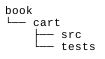
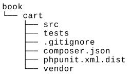
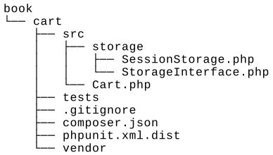
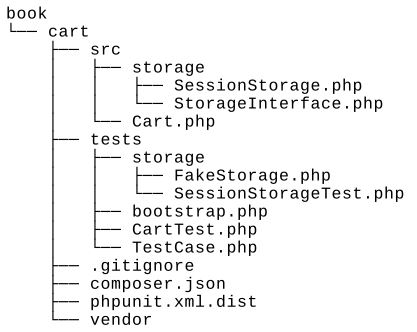
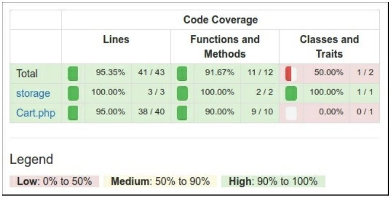
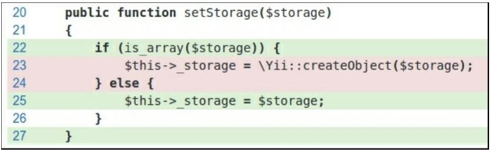

Тестирование с PHPUnit
===
PHPUnit является самой популярной платформой тестирования PHP. Он прост для конфигурации и использования. Кроме того, Платформа поддерживает отчеты о покрытии кода и имеет множество дополнительных плагинов. Codeception из предыдущего рецепта использует PHPUnit для собственной работы и написания модульных тестов. В этом рецепте мы создадим демонстрационное расширение корзины покупок с тестами PHPUnit.

Подготовка 
---
Создайте новое yii2-app-basic приложение с помощью диспетчера пакетов Composer, как описано в официальном руководстве по адресу <http://www.yiiframework.com/doc-2.0/guide-start-installation.html>. 
По русски <http://yiiframework.domain-na.me/doc/guide/2.0/ru/start-installation>

Как это сделать...
---
Во-первых, мы должны создать новый пустой каталог для собственного расширения.

***Подготовка структуры расширения***

1 Сначала создайте структуру каталогов для расширения:



 Для работы с расширением в качестве пакета Composer подготовьте файл book/cart/composer.json, как этот:
```php
{
    "name": "book/cart",
    "type": "yii2-extension",
    "require": {
        "yiisoft/yii2": "~2.0"
    },
    "require-dev": {
        "phpunit/phpunit": "4.*"
    },
    "autoload": {
        "psr -4": {
        "book\\cart\\": "src/",
        "book\\cart\\tests\\": "tests/"
    }
    },
    "extra": {
        "asset-installer-paths": {
            "npm-asset-library": "vendor/npm",
            "bower-asset-library": "vendor/bower"
        }
    }
}
```

2 Добавить в файл book/cart/.gitignore следующие строки:
```php
/vendor
/composer.lock
```

3 Добавьте следующие строки в файл конфигурации PHPUnit по умолчанию book/cart/phpunit.xml.dist:
```php
<?xml version="1.0" encoding="utf-8"?>
<phpunit bootstrap="./tests/bootstrap.php"
    colors="true"
    convertErrorsToExceptions="true"
    convertNoticesToExceptions="true"
    convertWarningsToExceptions="true"
    stopOnFailure="false">
    <testsuites>
        <testsuite name="Test Suite">
            <directory>./tests</directory>
        </testsuite>
    </testsuites>
    <filter>
        <whitelist>
            <directory suffix=".php">./src/</directory>
        </whitelist>
    </filter>
</phpunit>
```
4 Установите все зависимости расширения:

***composer install***

5 Теперь мы должны получить следующую структуру:


***Написание кода расширения***

Чтобы написать код расширения, выполните следующие действия:

1 Создайте класс book\cart\cart в каталоге src:
```
<?php
namespace book\cart;
use book\cart\storage\StorageInterface;
use yii\base\Component;
use yii\base\InvalidConfigException;
class Cart extends Component
{
    /**
    * @var StorageInterface
    */
    private $_storage;
    /**
    * @var array
    */
    private $_items;
    public function setStorage($storage)
    {
        if (is_array($storage)) {
            $this->_storage = \Yii::createObject($storage);
        } else {
            $this->_storage = $storage;
        }
    }
    public function add($id, $amount = 1)
    {
        $this->loadItems();
        if (isset($this->_items[$id])) {
            $this->_items[$id] += $amount;
        } else {
            $this->_items[$id] = $amount;
        }
        $this->saveItems();
    }
    public function set($id, $amount)
    {
        $this->loadItems();
        $this->_items[$id] = $amount;
        $this->saveItems();
    }
    public function remove($id)
    {
        $this->loadItems();
        if (isset($this->_items[$id])) {
            unset($this->_items[$id]);
        }
        $this->saveItems();
    }
    public function clear()
    {
        $this->loadItems();
        $this->_items = [];
        $this->saveItems();
    }
    public function getItems()
    {
        $this->loadItems();
        return $this->_items;
    }
    public function getCount()
    {
        $this->loadItems();
        return count($this->_items);
    }
    public function getAmount()
    {
        $this->loadItems();
        return array_sum($this->_items);
    }
    private function loadItems()
    {
        if ($this->_storage === null) {
            throw new InvalidConfigException('Storage must be set');
        }
        if ($this->_items === null) {
            $this->_items = $this->_storage->load();
        }
    }
    private function saveItems()
    {
        $this->_storage->save($this->_items);
    }
}
```

2 Создайте интерфейс Storageinterface в подкаталоге src/storage:
```php
<?php
namespace book\cart\storage;
interface StorageInterface
{
/**
* @return array
*/
public function load();
/**
* @param array $items
*/
public function save(array $items);
}
```
И класс SessionStorage:
```php
namespace book\cart\storage;
use Yii;
class SessionStorage implements StorageInterface
{
    public $sessionKey = 'cart';
    public function load()
    {
        return Yii::$app->session->get($this->sessionKey, []);
    }
    public function save(array $items)
    {
        Yii::$app->session->set($this->sessionKey, $items);
    }
}
```

3 Теперь мы должны получить следующую структуру:


***Написание тестов расширений***

Чтобы провести тест расширения, выполните следующие действия:

1 Добавьте book/cart/tests/bootstrap.php как скрипт при входе для PHPUnit:
```php
<?php
defined('YII_DEBUG') or define('YII_DEBUG', true);
defined('YII_ENV') or define('YII_ENV', 'test');
require( DIR  . '/../vendor/autoload.php');
require( DIR  . '/../vendor/yiisoft/yii2/Yii.php');
```

2 Создайте тестовый базовый класс, инициализируя приложение Yii перед каждым тестом и уничтожая приложение впоследствии:
```php
<?php
namespace book\cart\tests;
use yii\di\Container;
use yii\web\Application;
abstract class TestCase extends \PHPUnit_Framework_TestCase
{
    protected function setUp()
    {
        parent::setUp();
        $this->mockApplication();
    }
    protected function tearDown()
    {
        $this->destroyApplication();
        parent::tearDown();
    }
    protected function mockApplication()
    {
        new Application([
            'id' => 'testapp',
            'basePath' => 	DIR	,
            'vendorPath' => dirname(	DIR	) . '/vendor',
        ]);
    }
    protected function destroyApplication()
    {
        \Yii::$app = null;
        \Yii::$container = new Container();
    }
}
```

3 Добавьте класс FakeStorage , реализующий интерфейс StorageInterface:
```php
<?php
namespace book\cart\tests\storage;
use book\cart\storage\StorageInterface;
class FakeStorage implements StorageInterface
{
    private $items = [];
    public function load()
    {
        return $this->items;
    }
    public function save(array $items)
    {
        $this->items = $items;
    }
}
```
Он будет хранить элементы в частной переменной вместо работы с реальным сеансом. Это позволяет выполнять тесты независимо (без реального драйвера хранилища), а также повышает производительность тестирования.

4 Добавьте класс cartTest:
```php
<?php
namespace book\cart\tests;
use book\cart\Cart;
use book\cart\tests\storage\FakeStorage;
class CartTest extends TestCase
{
    /**
    * @var Cart
    */
    private $cart;
    public function setUp()
    {
        parent::setUp();
        $this->cart = new Cart(['storage' => new FakeStorage()]);
    }
    public function testEmpty()
    {
        $this->assertEquals([], $this->cart->getItems());
        $this->assertEquals(0, $this->cart->getCount());
        $this->assertEquals(0, $this->cart->getAmount());
    }
    public function testAdd()
    {
        $this->cart->add(5, 3);
        $this->assertEquals([5 => 3], $this->cart->getItems());
        $this->cart->add(7, 14);
        $this->assertEquals([5 => 3, 7 => 14], $this->cart->getItems());
        $this->cart->add(5, 10);
        $this->assertEquals([5 => 13, 7 => 14], $this->cart->getItems());
    }
    public function testSet()
    {
        $this->cart->add(5, 3);
        $this->cart->add(7, 14);
        $this->cart->set(5, 12);
        $this->assertEquals([5 => 12, 7 => 14], $this->cart->getItems());
    }
    public function testRemove()
    {
        $this->cart->add(5, 3);
        $this->cart->remove(5);
        $this->assertEquals([], $this->cart->getItems());
    }
    public function testClear()
    {
        $this->cart->add(5, 3);
        $this->cart->add(7, 14);
        $this->cart->clear();
        $this->assertEquals([], $this->cart->getItems());
    }
    public function testCount()
    {
        $this->cart->add(5, 3);
        $this->assertEquals(1, $this->cart->getCount());
        $this->cart->add(7, 14);
        $this->assertEquals(2, $this->cart->getCount());
    }
    public function testAmount()
    {
        $this->cart->add(5, 3);
        $this->assertEquals(3, $this->cart->getAmount());
        $this->cart->add(7, 14);
        $this->assertEquals(17, $this->cart->getAmount());
    }
    public function testEmptyStorage()
    {
        $cart = new Cart();
        $this->setExpectedException('yii\base\InvalidConfigException');
        $cart->getItems();
    }
}
```

5 	Добавьте отдельный тест для проверки класса SessionStorage:
```php
<?php
namespace book\cart\tests\storage;
use book\cart\storage\SessionStorage;
use book\cart\tests\TestCase;
class SessionStorageTest extends TestCase
{
    /**
    * @var SessionStorage
    */
    private $storage;
    public function setUp()
    {
        parent::setUp();
        $this->storage = new SessionStorage(['key' => 'test']);
    }
    public function testEmpty()
    {
        $this->assertEquals([], $this->storage->load());
    }
    public function testStore()
    {
        $this->storage->save($items = [1 => 5, 6 => 12]);
        $this->assertEquals($items, $this->storage->load());
    }
}
```

6 Сейчас мы должны получить следующую структуру:


Запуск тестов

Во время установки всех зависимостей с помощью команды composer install менеджер пакетов Composer устанавливает пакет PHPUnit в каталог vendor и помещает исполняемый файл phpunit в подкаталог vendor/bin.
Теперь мы можем запустить следующий скрипт:
```php
cd book/cart
vendor/bin/phpunit
```
Мы должны увидеть следующий отчет по испытаниям:
```php
PHPUnit 4.8.26 by Sebastian Bergmann and contributors.
Time: 906 ms, Memory: 11.50MB
OK (10 tests, 16 assertions)
```
Каждая точка показывает успешный результат соответствующего теста.
Попробуйте намеренно сломать собственную корзину, комментируя операцию unset:
```php
class Cart extends Component
{
    public function remove($id)
    {
        $this->loadItems();
        if (isset($this->_items[$id])) {
            // unset($this->_items[$id]);
        }
        $this->saveItems();
    }
}
```
Запустите тесты еще раз:
```php
PHPUnit 4.8.26 by Sebastian Bergmann and contributors.
. . . F	
Time: 862 ms, Memory: 11.75MB
There was 1 failure:
1) book\cart\tests\CartTest::testRemove
Failed asserting that two arrays are equal.
	 Expected
+++ Actual
@@ @@
Array (
+	5 => 3
)
/book/cart/tests/CartTest.php:52
FAILURES!
Tests: 10, Assertions: 16, Failures: 1
```
В этом случае мы видели один сбой (помеченный как F вместо точки) и отчет об ошибке.

***Анализ покрытия кода***

Необходимо установить расширение XDebug PHP с https://xdebug.org. Например, в Ubuntu или Debian в терминале можно ввести следующее:

***sudo apt-get install php5-xdebug***

В Windows необходимо открыть php.ini-файл и добавить пользовательский код с путем к каталогу установки PHP:
```php
[xdebug]
zend_extension_ts=C:/php/ext/php_xdebug.dll

```
Кроме того, если вы используете не потокобезопасный выпуск, введите следующую команду:
```php
[xdebug]
zend_extension=C:/php/ext/php_xdebug.dll
```
После установки XDebug снова запустите тесты с флагом -- coverage-html и укажите каталог отчетов:

***vendor/bin/phpunit --coverage-html tests/_output***

После запуска откройте tests/_output/index.html-файл в вашем браузере вы увидите отчет о явном покрытии для каждого каталога и класса:


Вы можете нажать на любой класс и проанализировать, какие строки кода не были выполнены во время тестирования  процесс. Например, откройте наш отчет класс корзины:


В нашем случае мы забыли протестировать создание хранилища из конфигурации массива.

***Использование компонента***

После публикации расширения в Packagist мы можем установить проект один-в-один к любому проекту:
```php
composer require book/cart
```
Кроме того, включите компонент в файле конфигурации приложения:
```php
'components' => [
    // ...
    'cart' => [
        'class' => 'book\cart\Cart',
        'storage' => [
            'class' => 'book\cart\storage\SessionStorage',
        ],
    ],
],
```
В качестве альтернативного способа без публикации расширения в Packagist мы должны настроить псевдоним @book для включения правильной автоматической загрузки классов:
```php
$config = [
    'id' => ' basic',
    'basePath' => dirname(__DIR__),
    'bootstrap' => ['log'],
    'aliases' => [
        '@book' => dirname(__DIR__) . '/book',
    ],
    'components' => [
        'cart' => [
            'class' => 'book\cart\Cart',
            'storage' => [
                'class' => 'book\cart\storage\SessionStorage',
            ],
        ],
    // ...
    ],
]
```
В любом случае, мы можем использовать его как компонент yii::$app->cart в нашем проекте:
```php
Yii::$app->cart->add($product->id, $amount);
```

Как это работает...
---
Перед созданием собственных тестов необходимо просто создать любой подкаталог и добавить phpunit.xml или phpunit.xml.dist-файл в корневом каталоге проекта:
```php
<?xml version="1.0" encoding="utf-8"?>
<phpunit bootstrap="./tests/bootstrap.php"
    colors="true"
    convertErrorsToExceptions="true"
    convertNoticesToExceptions="true"
    convertWarningsToExceptions="true"
    stopOnFailure="false">
    <testsuites>
        <testsuite name="Test Suite">
            <directory>./tests</directory>
        </testsuite>
    </testsuites>
    <filter>
        <whitelist>
            <directory suffix=".php">./src/</directory>
        </whitelist>
    </filter>
</phpunit>
```
PHPUnit загружает конфигурацию из второго файла, если первый не существует в рабочем каталоге. Кроме того, вы можете создать bootstrap.php файл путем инициализации autoloader и среды вашего фреймворка:
```php
<?php
defined('YII_DEBUG') or define('YII_DEBUG', true);
defined('YII_ENV') or define('YII_ENV', 'test');
require( DIR  . '/../vendor/autoload.php');
require( DIR  . '/../vendor/yiisoft/yii2/Yii.php');
```
Наконец, можно установить PHPUnit с помощью Composer (локально или глобально) и использовать команду консоли phpunit в каталоге с файлом конфигурации XML.
PHPUnit сканирует каталог тестирования и находит файлы с суффиксом *Test.php . Все тестовые классы должны расширять класс PHPUnit_Framework_Testcase и содержать открытые методы с префиксом test*:
```php
class MyTest extends TestCase
{
    public function testSomeFunction()
    {
        $this->assertTrue(true);
    }
}
```
В теле тестов можно использовать любой из существующих методов assert*:
```php
$this->assertEqual('Alex', $model->name);
$this->assertTrue($model->validate());
$this->assertFalse($model->save());
$this->assertCount(3, $items);
$this->assertArrayHasKey('username', $model->getErrors());
$this->assertNotNull($model->author);
$this->assertInstanceOf('app\models\User', $model->author);
```
Кроме того, можно переопределить методы setUp() или tearDown() для добавления выражений, которые будут выполняться до и после каждого метода теста.
Например, можно определить собственный базовый класс TestCase путем повторной инициализации приложения Yii:
```php
<?php
namespace book\cart\tests;
use yii\di\Container;
use yii\web\Application;
abstract class TestCase extends \PHPUnit_Framework_TestCase
{
    protected function setUp()
    {
        parent::setUp();
        $this->mockApplication();
    }
    protected function tearDown()
    {
        $this->destroyApplication();
        parent::tearDown();
    }
    protected function mockApplication()
    {
        new Application([
            'id' => 'testapp',
            'basePath' => __DIR__,
            'vendorPath' => dirname(__DIR__) . '/vendor',
        ]);
    }
    protected function destroyApplication()
    {
        \Yii::$app = null;
        \Yii::$container = new Container();
    }
}
```
Теперь вы можете расширить этот класс на подклассы. Даже ваш метод тестирования будет работать с собственным экземпляром приложения. Это помогает избежать побочных эффектов и создать независимые тесты.

***Замечание***: Yii 2.0.* использует старый PHPUnit 4.* Версия для совместимости с PHP 5.4.

Смотрите так же
---
* Всю информацию об использовании PHPUnit см. в официальной документации по адресу
<https://phpunit.de/manual/current/en/index.html>
* Рецепт  Тестирование приложения с Codeception
