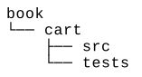
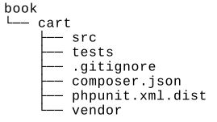
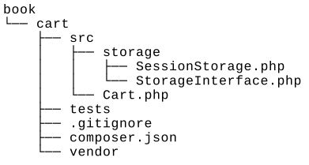
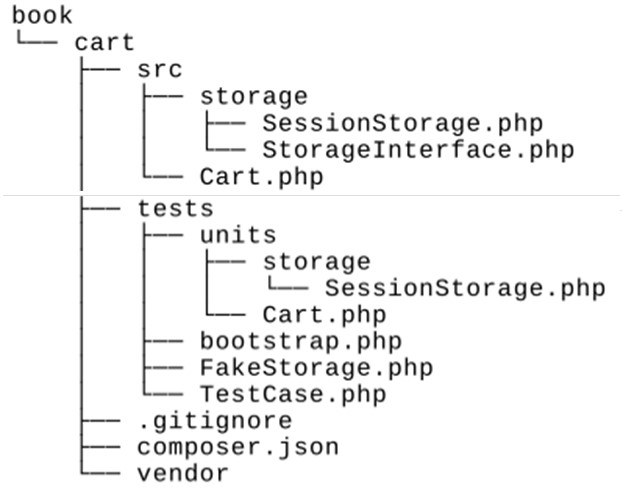
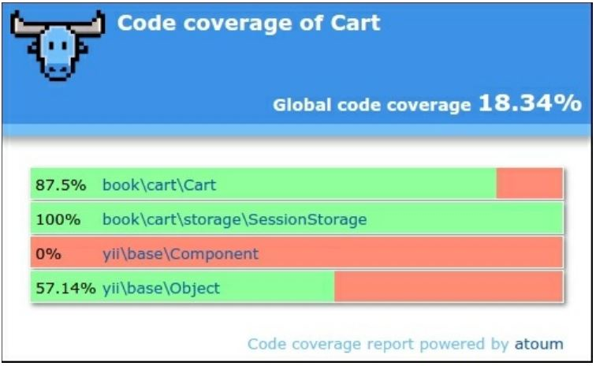

Unit тестирование с Atoum
===
Кроме того phpunit и Codeception, Atoum фреймворк простой модульного тестирования. Эту платформу можно использовать для тестирования расширений или кода приложения.

Подготовка 
---
Создайте пустой каталог для нового проекта.

Как это сделать...
---
В этом рецепте мы создадим демонстрационное расширение корзины покупок с тестами Atoum.

***Подготовка структуры расширения***

1 Сначала создайте структуру каталогов для расширения:


2 Для работы с расширением в качестве пакета composer подготовьте файл book/cart/composer.json следующим образом:
```php
{
    "name": "book/cart",
    "type": "yii2-extension",
    "require": {
        "yiisoft/yii2": "~2.0"
    },
    "require-dev": {
        "atoum/atoum": "A2.7"
    },
    "autoload": {
        "psr -4": {
        "book\\cart\\": "src/",
        "book\\cart\\tests\\": "tests/"
    }
    },
    "extra": {
        "asset-installer-paths": {
            "npm-asset-library": "vendor/npm",
            "bower-asset-library": "vendor/bower"
        }
    }
}
```

3 Добавьте следующие строки в файл book/cart/, .gitignore:
```php
/vendor
/composer.lock
```
4 Установите все зависимости расширения:

***composer install***

5 Теперь мы получим следующую структуру:


***Написание кода расширения***

Скопируйте классы Cart, Storageinterface и Sessionstorage из модульного тестирования с помощью рецепта PHPUnit.
Наконец, мы должны получить следующую структуру:



***Написание тестов расширений***

1 Добавьте book/cart/tests/bootstrap.php:
```php
<?php
defined('YII_DEBUG') or define('YII_DEBUG', true);
defined('YII_ENV') or define('YII_ENV', 'test');
require( DIR  . '/../vendor/autoload.php');
require( DIR  . '/../vendor/yiisoft/yii2/Yii.php');
```

2 Создайте тестовый базовый класс, инициализируя приложение Yii перед каждым тестом и уничтожая приложение после них:
```php
<?php
namespace book\cart\tests;
use yii\di\Container;
use yii\console\Application;
use mageekguy\atoum\test;
abstract class TestCase extends test
{
    public function beforeTestMethod($method)
    {
        parent::beforeTestMethod($method);
        $this->mockApplication();
    }
    public function afterTestMethod($method)
    {
        $this->destroyApplication();
        parent::afterTestMethod($method);
    }
    protected function mockApplication()
    {
        new Application([
            'id' => 'testapp',
            'basePath' => __DIR__,
            'vendorPath' => dirname(__DIR__) . '/vendor',
            'components' => [
                'session' => [
                    'class' => 'yii\web\Session',
                ],
            ]
        ]);
    }
    protected function destroyApplication()
    {
        \Yii::$app = null;
        \Yii::$container = new Container();
    }
}
```

3 Добавьте класс FakeStorage , реализующий интерфейс StorageInterface:
```php
<?php
namespace book\cart\tests;
use book\cart\storage\StorageInterface;
class FakeStorage implements StorageInterface
{
    private $items = [];
    public function load()
    {
        return $this->items;
    }
    public function save(array $items)
    {
        $this->items = $items;
    }
}
```
Это позволит хранить элементы в частной переменной вместо работы с реальным сеансом. Это позволяет нам запускать тесты независимо (без реального драйвера хранилища), а также улучшает производительность тестирования.

4 Добавьте класс теста Корзина:
```php
<?php
namespace book\cart\tests\units;
use book\cart\tests\FakeStorage;
use book\cart\Cart as TestedCart;
use book\cart\tests\TestCase;
class Cart extends TestCase
{
    /**
    * @var TestedCart
    */
    private $cart;
    public function beforeTestMethod($method)
    {
        parent::beforeTestMethod($method );
        $this->cart = new TestedCart(['storage' => new FakeStorage()]);
    }
    public function testEmpty()
    {
        $this->array($this->cart->getItems())->isEqualTo([]);
        $this->integer($this->cart->getCount())->isEqualTo(0);
        $this->integer($this->cart->getAmount())->isEqualTo(0);
    }
    public function testAdd()
    {
        $this->cart->add(5, 3);
        $this->array($this->cart->getItems())->isEqualTo([5 => 3]);
        $this->cart->add(7, 14);
        $this->array($this->cart->getItems())->isEqualTo([5 => 3, 7 => 14]);
        $this->cart->add(5, 10);
        $this->array($this->cart->getItems())->isEqualTo([5 => 13, 7 => 14]);
    }
    public function testSet()
    {
        $this->cart->add(5, 3);
        $this->cart->add(7, 14);
        $this->cart->set(5, 12);
        $this->array($this->cart->getItems())->isEqualTo([5 => 12, 7 => 14]);
    }
    public function testRemove()
    {
        $this->cart->add(5, 3);
        $this->cart->remove(5);
        $this->array($this->cart->getItems())->isEqualTo([]);
    }
    public function testClear()
    {
        $this->cart->add(5, 3);
        $this->cart->add(7, 14);
        $this->cart->clear();
        $this->array($this->cart->getItems())->isEqualTo([]);
    }
    public function testCount()
    {
        $this->cart->add(5, 3);
        $this->integer($this->cart->getCount())->isEqualTo(1);
        $this->cart->add(7, 14);
        $this->integer($this->cart->getCount())->isEqualTo(2);
    }
    public function testAmount()
    {
        $this->cart->add(5, 3);
        $this->integer($this->cart->getAmount())->isEqualTo(3);
        $this->cart->add(7, 14);
        $this->integer($this->cart->getAmount())->isEqualTo(17);
    }
    public function testEmptyStorage()
    {
        $cart = new TestedCart();
        $this->exception(function () use ($cart) {
            $cart->getItems();
        })->hasMessage('Storage must be set');
    }
}
```

5 Добавьте отдельный тест для проверки класса SessionStorage:
```php
<?php
namespace book\cart\tests\units\storage;
use book\cart\storage\SessionStorage as TestedStorage;
use book\cart\tests\TestCase;
class SessionStorage extends TestCase
{
    /**
    * @var TestedStorage
    */
    private $storage;
    public function beforeTestMethod($method)
    {
        parent::beforeTestMethod($method);
        $this->storage = new TestedStorage(['key' => 'test']);
    }
    public function testEmpty()
    {
        $this
        ->given($storage = $this->storage)
        ->then
        ->array($storage->load())
        ->isEqualTo([]);
    }
    public function testStore()
    {
        $this
        ->given($storage = $this->storage)
        ->and($storage->save($items = [1 => 5, 6 => 12]))
        ->then
        ->array($this->storage->load())
        ->isEqualTo($items)
    ;
    }
}
```
6 Теперь мы получим следующую структуру:


***Запуск тестов***

Во время установки всех зависимостей с помощью команды composer install менеджер пакетов Composer устанавливает пакет Atounm в каталог vendor и помещает исполняемый файл atoum в подкаталог vendor/bin.
Теперь мы можем запустить следующий скрипт:
```php
cd book/cart
vendor/bin/atoum -d tests/units -bf tests/bootstrap.php
```
Также, мы должны увидеть следующий отчет по испытаниям:
```php
> atoum path: /book/cart/vendor/atoum/atoum/vendor/bin/atoum
> atoum version: 2.7.0
> atoum path: /book/cart/vendor/atoum/atoum/vendor/bin/atoum
> atoum version: 2.7.0
> PHP path: /usr/bin/php5
> PHP version:
=> PHP 5.5.9-1ubuntu4.16 (cli)
> book\cart\tests\units\Cart...
[SSSSSSSS	] [8/8]
=> Test duration: 1.13 seconds.
=> Memory usage: 3.75 Mb.
> book\cart\tests\units\storage\SessionStorage...
[SS	] [2/2]
=> Test duration: 0.03 second.
=> Memory usage: 1.00 Mb.
> Total tests duration: 1.15 seconds.
> Total tests memory usage: 4.75 Mb.
> Code coverage value: 16.16%
```
Каждый символ S показывает успешный результат соответствующего теста.
Попробуйте намеренно сломать корзину, комментируя операцию unset:
```php
class Cart extends Component
{
    public function remove($id)
    {
    $this->loadItems();
    if (isset($this->_items[$id])) {
        // unset($this->_items[$id]);
    }
    $this->saveItems();
    }
}
```
Запустите тесты еще раз:
```php
> atoum version: 2.7.0
> PHP path: /usr/bin/php5
> PHP version:
=> PHP 5.5.9-1ubuntu4.16 (cli)
book\cart\tests\units\Cart...
[SSFSSSSS	] [8/8]
=> Test duration: 1.09 seconds.
=> Memory usage: 3.25 Mb.
> book\cart\tests\units\storage\SessionStorage...
[SS	] [2/2]
=> Test duration: 0.02 second.
=> Memory usage: 1.00 Mb.
Failure (2 tests, 10/10 methods, 0 void method, 0 skipped method, 0 uncompleted method, 1
failure, 0 error, 0 exception)!
> There is 1 failure:
=> book\cart\tests\units\Cart::testRemove():
In file /book/cart/tests/units/Cart.php on line 53, mageekguy\atoum\asserters\phpArray()
failed: array(1) is not equal to array(0)
-Expected
+Actual
@@ -1 +1,3 @@
-array(0) {
+array(1) {
+	[5] =>
+ int(3)
```
В этом случае мы видели один сбой (помеченный как F вместо точки) и отчет об ошибке.

***Анализ покрытия кода***

Необходимо установить расширение XDebug PHP с https://xdebug.org. Например, в Ubuntu или Debian вы можете ввести в терминал следующее:

***sudo apt-get install php5-xdebug***

В Windows необходимо открыть php.ini-файл и добавьте пользовательский код с путем к каталогу установки PHP:
```php
[xdebug]
zend_extension_ts=C:/php/ext/php_xdebug.dll
```
Кроме того, если вы используете не потокобезопасный выпуск, введите следующую команду:
```php
[xdebug]
zend_extension=C:/php/ext/php_xdebug.dll
```
После установки XDebug создайте book/cart/coverage.php с параметрами отчета о покрытии:
```php
<?php
use \mageekguy\atoum;
/** @var atoum\scripts\runner $script */
$report = $script->addDefaultReport();
$coverageField = new atoum\report\fields\runner\coverage\html('Cart', 	DIR	 .
' /tests/coverage');
$report->addField($coverageField);
```
Теперь выполните тесты снова с опцией -c для использования этой конфигурации:

***vendor/bin/atoum -d tests/units -bf tests/bootstrap.php -c coverage.php***

После выполнения тестов откройтеtests/coverage/index.html файл в вашем браузере. Вы увидите отчет о явном покрытии для каждого каталога и класса:


Вы можете нажать на любой класс и проанализировать, какие строки кода не были выполнены в процессе тестирования.

Как это работает...
---
Платформа тестирования Atoum поддерживает синтаксический поток поведенческого проектирования (BDD) следующим образом:
```php
public function testSome()
{
$this
    ->given($cart = new TestedCart())
    ->and($cart->add(5, 13))
    ->then
    ->sizeof($cart->getItems())
    ->isEqualTo(1)
    ->array($cart->getItems())
    ->isEqualTo([5 => 3])
    ->integer($cart->getCount())
    ->isEqualTo(1)
    ->integer($cart->getAmount())
    ->isEqualTo(3);
}
```
Однако для написания модульных тестов можно использовать обычный phpunit-подобный синтаксис:
```php
public function testSome()
{
    $cart = new TestedCart();
    $cart->add(5, 3);
    $this
        ->array($cart->getItems())->isEqualTo([5 => 3])
        ->integer($cart->getCount())->isEqualTo(1)
        ->integer($cart->getAmount())->isEqualTo(3);
}
```
Atoum также поддерживает отчеты о покрытии кода для анализа качества тестирования.

Смотрите так же
---
* Для получения дополнительной информации об Atoum, обратитесь к <http://docs.atoum.org/en/latest/>
* Для источников и примеров, см. <https ://github.com/atoum/atoum>
* Рецепт Модульное тестирование с PHPUnit
