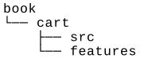
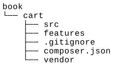
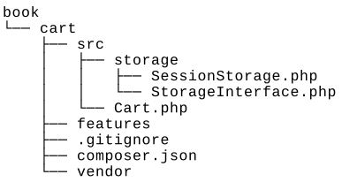

Unit тестирование с Behat
===
Behat-это bdd-фреймворк для тестирования кода с помощью удобочитаемых предложений, которая описывает поведение кода в различных случаях использования.

Подготовка
---
Создание пустого каталога для нового проекта.

Как это сделать...
---
В этом рецепте мы создадим демонстрационное расширение корзины покупок с тестами Behat.

***Подготовка структуры расширения***

1 Сначала создайте структуру каталогов для расширения:


2 Для работы с расширением в качестве пакета Composer подготовьте файл book/cart/composer.json следующим образом:
```php
{
    "name": "book/cart",
    "type": "yii2-extension",
    "require": {
        "yiisoft/yii2": "~2.0"
    },
    "require-dev": {
        "phpunit/phpunit": "4.*",
        "behat/behat": "A3.1"
    },
    "autoload": {
        "psr -4": {
            "book\\cart\\": "src/",
            "book\\cart\\features\\": "features/"
        }
    },
    "extra": {
        "asset-installer-paths": {
            "npm-asset-library": "vendor/npm",
            "bower-asset-library": "vendor/bower"
        }
    }
}
```

3 Добавьте следующие строки в файл book/cart/.gitignore:
```php
/vendor
/composer.lock
```

4 Установите все зависимости расширения:

***composer install***

5. Теперь мы получаем следующую структуру:


***Написание кода расширения***

Скопируйте классы Cart, Storageinterface и Sessionstorage из рецепта  Модульное тестирования с помощью PHPUnit.
Наконец, мы получаем следующую структуру:



***Написание тестов расширений***

1 Добавьте book/cart/features/bootstrap/bootstrap.php как начальный  скрипт:
```php
<?php
defined('YII_DEBUG') or define('YII_DEBUG', true);
defined('YII_ENV') or define('YII_ENV', 'test');
require_once __DIR__ . '/../../vendor/yiisoft/yii2/Yii.php';
```

2 Создайте features/cart.feature и сценарии тестирования корзины:
```php
Feature: Shopping cart
In order to buy products
As a customer
I need to be able to put interesting products into a cart
Scenario: Checking empty cart
Given there is a clean cart
Then I should have 0 products
Then I should have 0 product
And the overall cart amount should be 0
Scenario: Adding products to the cart
Given there is a clean cart
When I add 3 pieces of 5 product
Then I should have 3 pieces of 5 product
And I should have 1 product
And the overall cart amount should be 3
When I add 14 pieces of 7 product
Then I should have 3 pieces of 5 product
And I should have 14 pieces of 7 product
And I should have 2 products
And the overall cart amount should be 17
When I add 10 pieces of 5 product
Then I should have 13 pieces of 5 product
And I should have 14 pieces of 7 product
And I should have 2 products
And the overall cart amount should be 27
Scenario: Change product count in the cart
Given there is a cart with 5 pieces of 7 product
When I set 3 pieces for 7 product
Then I should have 3 pieces of 7 product
Scenario: Remove products from the cart
Given there is a cart with 5 pieces of 7 product
When I add 14 pieces of 7 product
And I clear cart
Then I should have empty cart
```

3 Добавьте функции тестирования компонента features/storage.feature:
```php
Feature: Shopping cart storage
I need to be able to put items into a storage
Scenario: Checking empty storage
Given there is a clean storage
Then I should have empty storage
Scenario: Save items into storage
Given there is a clean storage
When I save 3 pieces of 7 product to the storage
Then I should have 3 pieces of 7 product in the storage
```

4 Добавьте реализацию для всех шагов в файл features/bootstrap/CartContext.php:
```php
<?php
use Behat\Behat\Context\SnippetAcceptingContext;
use book\cart\Cart;
use book\cart\features\bootstrap\storage\FakeStorage;
use yii\di\Container;
use yii\web\Application;
require_once __DIR__ . '/bootstrap.php';
class CartContext implements SnippetAcceptingContext
{
    /**
    * @var Cart
    * */
    private $cart;
    /**
    * @Given there is a clean cart
    */
    public function thereIsACleanCart()
    {
        $this->resetCart();
    }
    /**
    * @Given there is a cart with :pieces of :product product
    */
    public function thereIsAWhichCostsPs($product, $amount)
    {
        $this->resetCart();
        $this->cart->set($product, floatval($amount));
    }
    /**
    * @When I add :pieces of :product
    */
    public function iAddTheToTheCart($product, $pieces)
    {
        $this->cart->add($product, $pieces);
    }
    /**
    * @When I set :pieces for :arg2 product
    */
    public function iSetPiecesForProduct($pieces, $product)
    {
        $this->cart->set($product, $pieces);
    }
    /**
    * @When I clear cart
    */
    public function iClearCart()
    {
        $this->cart->clear();
    }
    /**
    * @Then I should have empty cart
    */
    public function iShouldHaveEmptyCart()
    {
        PHPUnit_Framework_Assert::assertEquals(
            0,
            $this->cart->getCount()
        );
    }
    /**
    * @Then I should have :count product(s)
    */
    public function iShouldHaveProductInTheCart($count)
    {
        PHPUnit_Framework_Assert::assertEquals(
            intval($count),
            $this->cart->getCount()
        );
    }
    /**
    * @Then the overall cart amount should be :amount
    */
    public function theOverallCartPriceShouldBePs($amount)
    {
        PHPUnit_Framework_Assert::assertSame(
        intval($amount),
        $this->cart->getAmount()
        );
    }
    /**
    * @Then I should have :pieces of :product
    */
    public function iShouldHavePiecesOfProduct($pieces, $product)
    {
        PHPUnit_Framework_Assert::assertArraySubset(
            [intval($product) => intval($pieces)],
            $this->cart->getItems()
        );
    }
    private function resetCart()
    {
    $this->cart = new Cart(['storage' => new FakeStorage()]);
    }
}
```

5 Кроме того, в features/bootstrap/StorageContext.php файл, добавьте следующее:
```php
<?php
use Behat\Behat\Context\SnippetAcceptingContext;
use book\cart\Cart;
use book\cart\features\bootstrap\storage\FakeStorage;
use book\cart\storage\SessionStorage;
use yii\di\Container;
use yii\web\Application;
require_once __DIR__ . '/bootstrap.php';
class StorageContext implements SnippetAcceptingContext
{
    /**
    * @var SessionStorage
    * */
    private $storage;
    /**
    * @Given there is a clean storage
    */
    public function thereIsACleanStorage()
    {
        $this->mockApplication();
        $this->storage = new SessionStorage(['key' => 'test']);
    }
    /**
    * @When I save :pieces of :product to the storage
    */
    public function iSavePiecesOfProductToTheStorage($pieces, $product)
    {
        $this->storage->save([$product => $pieces]);
    }
    /**
    * @Then I should have empty storage
    */
    public function iShouldHaveEmptyStorage()
    {
        PHPUnit_Framework_Assert::assertCount(
        0,
        $this->storage->load()
    );
    }
    /**
    * @Then I should have :pieces of :product in the storage
    */
    public function iShouldHavePiecesOfProductInTheStorage($pieces, $product)
    {
        PHPUnit_Framework_Assert::assertArraySubset(
            [intval($product) => intval($pieces)],
            $this->storage->load()
        );
    }
    private function mockApplication()
    {
        Yii::$container = new Container();
        new Application([
            'id' => 'testapp',
            'basePath' => __DIR__,
            'vendorPath' => __DIR__ . '/../../vendor',
        ]);
    }
}
```
6 Добавить features/bootstrap/CartContext/FakeStorage.php файл с поддельным классом хранения:
```php
<?php
namespace book\cart\features\bootstrap\storage;
use book\cart\storage\StorageInterface;
class FakeStorage implements StorageInterface
{
    private $items = [];
    public function load()
    {
        return $this->items;
    }
    public function save(array $items)
    {
        $this->items = $items;
    }
}
```

7 Добавить в book/cart/behat.yml определения контекста:
```php
default:
    suites:
        default:
            contexts:
                - CartContext
                - StorageContext
```


8 Теперь мы получим следующую структуру:


Теперь мы можем запустить наши тесты.

***Запуск тестов***

Во время установки всех зависимостей с помощью команды composer install менеджер пакетов Composer устанавливает пакет Behat в каталог vendor и помещает исполняемый файл behat в подкаталог vendor/bin.
Теперь мы можем запустить следующий скрипт:
```php
cd book/cart
vendor/bin/behat
```
Также, мы должны увидеть следующий отчет по испытаниям:
```php
Feature: Shopping cart
In order to buy products
As a customer
I need to be able to put interesting products into a cart
Scenario: Checking empty cart   #   features/cart.feature:6
Given there is a clean cart     #   thereIsACleanCart()
Then I should have 0 products   #   iShouldHaveProductInTheCart()
Then I should have 0 product    #   iShouldHaveProductInTheCart()
And the overall cart amount should be 0 # theOverallCartPriceShouldBePs()
Feature: Shopping cart storage
I need to be able to put items into a storage
Scenario: Checking empty storage    # features/storage.feature:4
Given there is a clean storage      # thereIsACleanStorage()
Then I should have empty storage    # iShouldHaveEmptyStorage()
6 scenarios (6 passed)
31 steps (31 passed)
0m0.23s (13.76Mb)
```
Попробуйте намеренно сломать корзину, комментируя операцию unset:
```php
class Cart extends Component
{
    public function set($id, $amount)
    {
        $this->loadItems();
        // $this->_items[$id] = $amount;
        $this->saveItems();
    }
}
```
Теперь запустите тесты снова:
```php
Feature: Shopping cart
In order to buy products
As a customer
Feature: Shopping cart
In order to buy products
As a customer
I need to be able to put interesting products into a cart
Scenario: Change product count in the cart     # features/cart.feature:31
Given there is  a cart with 5 pieces of 7 prod # thereIsAWhichCostsPs()
When I set 3 pieces for 7 product              # iSetPiecesForProduct()
Then I should have 3 pieces of 7 product       # iShouldHavePiecesOf()
Failed asserting that an array has the subset Array &0 ( 
7 => 3
).
Scenario: Remove products from the cart                # features/cart.feature:36
Given there is  a cart with 5  pieces  of  7   prod    # thereIsAWhichCostsPs()
When I add 14 pieces of 7 product                      # iAddTheToTheCart()
And I clear cart                                       # iClearCart()
Then I should have empty cart                          # iShouldHaveEmptyCart()
— Failed scenarios:
features/cart.feature:31
6 scenarios (5 passed, 1 failed)
31 steps (30 passed, 1 failed)
0m0.22s (13.85Mb)
```
В этом случае мы видели один сбой и отчет об ошибке.

Как это работает...
---
Behat-это Платформа тестирования BDD. Это облегчает написание предыдущих удобочитаемых сценариев тестирования для низкоуровневой технической реализации.
Когда мы пишем Сценарии для каждой функции, мы можем использовать набор операторов:
```php
Scenario: Adding products to the cart
Given there is a clean cart
When I add 3 pieces of 5 product
Then I should have 3 pieces of 5 product
And I should have 1 product
And the overall cart amount should be 3
```
Behat анализирует наши предложения и находит соответствующую реализацию предложения в классе context:
```php
class FeatureContext implements SnippetAcceptingContext
{
    /**
    * @When I add :pieces of :product
    */
    public function iAddTheToTheCart($product, $pieces)
    {
        $this->cart->add($product, $pieces);
    }
}
```
Можно создать один класс FeatureContex t (по умолчанию) или набор определенных контекстов для групп объектов и сценариев.

Смотрите так же
---
Для получения дополнительной информации о Behat обратитесь к следующим URL:
* <http://docs.behat.org/en/v3.0/>
* <https://github.com/Behat/Behat>
И чтобы получить больше информации об альтернативных тестовых фреймворках, смотрите другие рецепты в этой главе.
