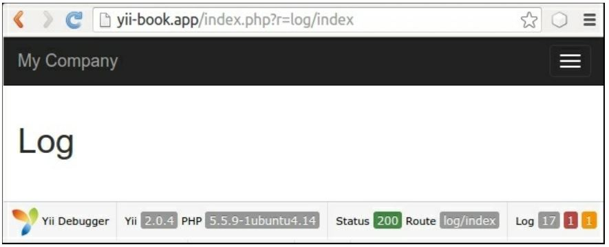
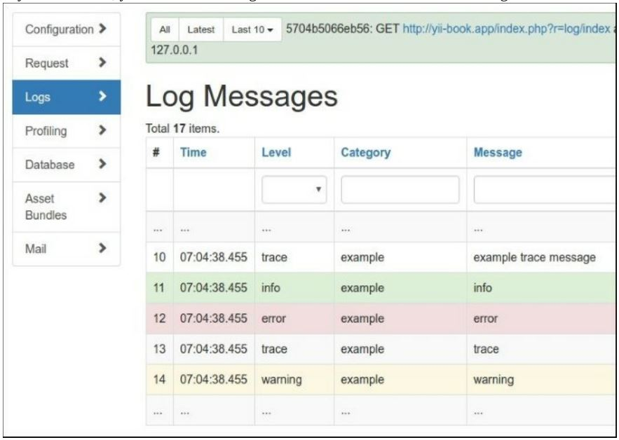
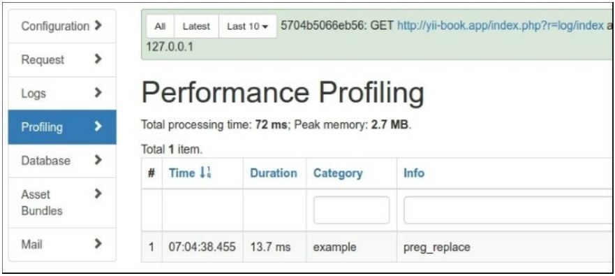

Использование различных журналов и маршрутов
===
Ведение журнала-это ключ к пониманию того, что на самом деле делает приложение, когда у вас нет возможности отладить его. Верьте или нет, даже если вы на 100% уверены, что приложение будет вести себя так, как ожидается, в производство, он может сделать много вещей, которые Вы не знали. Это нормально, так как никто не может знать обо всем. Поэтому, если мы ожидаем необычного поведения, мы должны знать об этом как можно скорее и иметь достаточно деталей, чтобы воспроизвести его. Это где логирование пригодится.
Yii позволяет разработчику не только регистрировать сообщения, но и обрабатывать их по-разному в зависимости от уровня и категории сообщения. Вы можете, например, написать сообщение в базу данных, отправить электронное письмо или просто показать его в браузере.
В этом рецепте мы будем обрабатывать сообщения журнала мудро: самое важное сообщение будет отправлено по электронной почте, менее важные сообщения будут сохранены в файлах A и B, а профилирование будет направлено в Firebug. Кроме того, в режиме разработки на экране будут отображаться все сообщения и сведения о профилировании.

Подготовка 
---
Создайте новое yii2-app-basic приложение с помощью диспетчера пакетов Composer, как описано в официальном руководстве по адресу <http://www.yiiframework.com/doc-2.0/guide-start-installation.html>. 
По русски <http://yiiframework.domain-na.me/doc/guide/2.0/ru/start-installation>

Как это сделать...
---
Выполните следующие действия:

1 Настройте ведение журнала с помощью config/web.php:
```php
'components' => [
    'log' => [
        'traceLevel' => 0,
        'targets' => [
            [
                'class' => 'yii\log\EmailTarget',
                'categories' => ['example'],
                'levels' => ['error'],
                'message' => [
                    'from' => ['log@example.com'],
                    'to' => ['developer1@example.com', 'developer2@example.com'],
                    'subject' => 'Log message',
                ],
            ],
            [
                'class' => 'yii\log\FileTarget',
                'levels' => ['error'],
                'logFile' => '@runtime/logs/error.log',
            ],
            [
                'class' => 'yii\log\FileTarget',
                'levels' => ['warning'],
                'logFile' => '@runtime/logs/warning.log',
            ],
            [
                'class' => 'yii\log\FileTarget',
                'levels' => ['info'],
                'logFile' => '@runtime/logs/info.log',
            ],
        ],
    ],
    'db' => require(	DIR	 . '/db.php'),
],
```

2 Теперь, мы выигрываем производя немного сообщений журнала в protected/controllers/LogController.php следующим образом:
```php
<?php
namespace app\controllers;
use yii\web\Controller;
use Yii;
class LogController extends Controller
{
    public function actionIndex()
    {
        Yii::trace('example trace message', 'example');
        Yii::info('info', 'example');
        Yii::error('error', 'example');
        Yii::trace('trace', 'example');
        Yii::warning('warning','example');
        Yii::beginProfile('preg_replace',	'example');
        for($i=0;$i<10000;$i++){
            preg_replace('~A[ a-z]+~',	'', 'test it');
        }
        Yii:: endProfile('preg_replace',	'example');
        return $this->render('index');
    }
}
```
и просматривать views/log/index.php:
```php
<div class="log-index">
    <h1>Log</h1>
</div>
```

3 Теперь выполните предыдущее действие несколько раз. На экране должен появиться заголовок журнала и панель отладки с номером сообщения журнала:


4  Если Вы кликните  на 17, Вы увидите веб-журнал, подобный показанному на следующем снимке экрана:



5 Журнал содержит все сообщения, которые мы зарегистрировали вместе со следами стека, метками времени, уровнями и категориями

6 Теперь откройте страницу профиля. Вы должны увидеть сообщения профилировщика, как показано на следующем снимке экрана:


Информация профилирования отображает общую Продолжительность выполнения собственного блока кода.

7 Поскольку мы только что изменили имена файлов журнала, а не пути, вы должны искать в runtime/logs, чтобы найти файлы журнала с именем named error.log, warning.log, и info.log

8 Внутри вы найдете следующие сообщения:
```php
2016-03-06 07:28:35 [127.0.0.1][-][-][error][example] error
2016-03-06 07:28:35 [127.0.0.1][-][-][warning][example] warning
2016-03-06 07:28:35 [127.0.0.1][-][-][info][example] info
```

Как это работает...
---
Когда один записывает сообщение черезYii::error, Yii::warning, Yii::info, or Yii::trace, Yii передает его на роутер.
В зависимости от того, как он настроен, он передает сообщения одному или нескольким целевым объектам, например, ошибки электронной почты, запись отладочной информации в файл A и запись предупреждающей информации в файл B.
Объект класса yii\log\Dispatcher обычно присоединяется к компоненту приложения с именем log. Поэтому, чтобы настроить его, мы должны установить его свойства в разделе компонентов файла конфигурации. Единственным настраиваемым свойством являются целевые объекты, содержащие массив маршрутов журналов и их конфигурации.
Мы определили четыре маршрута журнала. Рассмотрим их следующим образом:
```php
[
    'class' => 'yii\log\EmailTarget',
    'categories' => ['example'],
    'levels' => ['error'],
    // 'mailer' => 'mailer',
    'message' => [
        'from' => ['log@example.com'],
        'to' => ['developer1@example.com', 'developer2@example.com'],
        'subject' => 'Log error,
    ],
],
```
EmailTarget отправляет сообщения журнала по электронной почте через компонент yii:: $app->mailer по умолчанию. Мы ограничиваем категорию примером и уровень ошибкой. Электронное письмо будет отправлено из log@example.com для двух разработчиков и тема будет ошибка журнала:
```php
[
    'class' => 'yii\log\FileTarget',
    'levels' => [warning],
    'logFile' => '@runtime/logs/warning.log',
],
```
FileTarget добавляет сообщения об ошибках в указанный файл. Мы ограничиваем уровень сообщения предупреждением и используем файл с именем warning.log. Мы делаем то же самое для сообщений информационного уровня с помощью файла с именем Info.log.
Кроме того, мы можем использовать yii\log\SyslogTargett писать сообщения в Unix в файле /var/log/syslog и yii\log\DbTarget писать логи в базу данных. Для второго необходимо применить их миграции:

***./yii migrate --migrationPath=@yii/log/migrations/***

Есть еще...
---
Есть более интересные вещи о yii logging, которые рассматриваются в следующих подразделах.

***Yii::trace проитив Yii::getLogger()->log***

Yii::trace является простой оберткой Yii::log:
```php
public static function trace($message, $category = 'application')
{
    if (YII_DEBUG) {
        static::getLogger()->log($message, Logger::LEVEL_TRACE, $category);
    }
}
```
Таким образом yii:: trace регистрирует сообщение с уровнем трассировки, если Yii находится в режиме отладки.

***Yii::beginProfile и Yii::endProfile***

Эти методы используются для измерения времени выполнения некоторой части кода приложения. В нашем LogController мы измерили 10 000 выполнений preg_replace следующим образом:
```php
Yii::beginProfile('preg_replace',' example');
for($i=0;$i<10000;$i++){
    preg_replace('~A[ a-z]+~','', 'test it');
}
Yii::endProfile('preg_replace',' example');
```
Yii::beginProfile обозначает начало блока кода для профилирования. Мы должны установить уникальный маркер для каждого блока кода и дополнительно указать категорию:
```php
public static function beginProfile($token, $category = 'application') { ... }
```
Yii: :endProfile должен быть сопоставлен с предыдущим вызовом beginProfile с тем же именем категории: 
public static function endProfile($token, $category = 'application') { ... }
Вызовы begin и end также должны быть правильно вложенными.

***Немедленно регистрировать сообщения***

По умолчанию Yii сохраняет все сообщения журнала в памяти до завершения работы приложения. Это сделано по соображениям производительности и обычно работает нормально.
Однако при наличии консольного приложения с длительным временем работы сообщения журнала будут записываться не сразу. Чтобы убедиться, что Ваши сообщения будут зарегистрированы в любой момент, вы можете очистить их явно с помощью Yii:: $app - >getLogger () >flush (true) или изменить flushInterval и exportInterval для конфигурации консольного приложения:
```php
'components' => [
    'log' => ['flushInterval' => 1,
                'targets' => [
                    ['class' => 'yii\log\FileTarget','exportInterval' => 1,]
                ,]
    ,]
,]
],
```

Смотрите так же
---
* Чтобы узнать больше о регистрации, обратитесь к
<https://www.yiiframework.com/doc/guide/2.0/en/runtime-logging> 
 по русски https://www.yiiframework.com/doc/guide/2.0/ru/runtime-logging
* Рецепт Журналирование и использование контекстной информации
