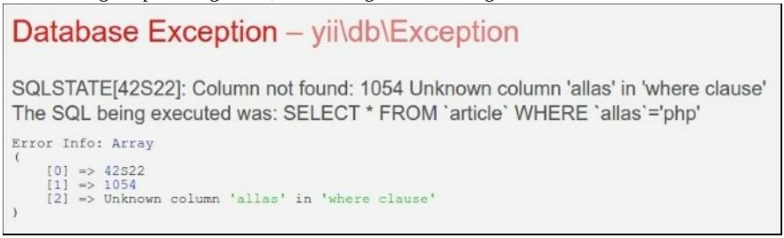
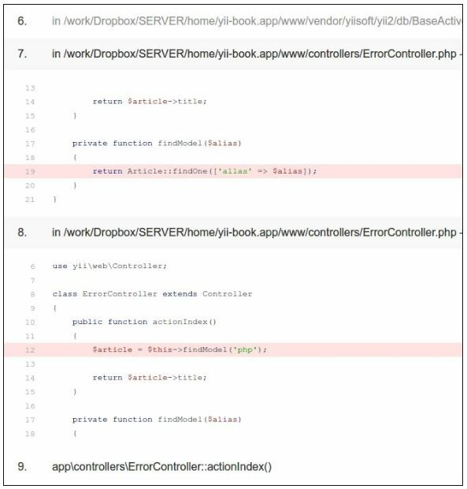

Анализ трассировки стека ошибок Yii
===
При возникновении ошибки yii может отображать трассировку стека ошибок вместе с ошибкой. Трассировка стека особенно полезна, когда нам нужно знать, что действительно вызвало ошибку, а не только тот факт, что произошла ошибка.

Подготовка 
---

1 Создайте новое yii2-app-basic приложение с помощью диспетчера пакетов Composer, как описано в официальном руководстве по адресу <http://www.yiiframework.com/doc-2.0/guide-start-installation.html>. 
По русски <http://yiiframework.domain-na.me/doc/guide/2.0/ru/start-installation>

2 Настройте базу данных и импортируйте следующую миграцию:

```php
<?php
use yii\db\Migration;
class m160308_093234_create_article_table extends Migration
{
    public function up()
    {
        $this->createTable('{{%article}}',	[
            'id' => $this->primaryKey(),
            'alias' => $this->string()->notNull(),
            'title' => $this->string()->notNull(),
            'text' => $this->text()->notNull(),
        ]);
    }
    public function down()
    {
        $this->dropTable('{{%article}}');
    }
}
```

3 Создать модель Article на yii.

Как это сделать...
---
Выполните следующие действия:

1 Теперь нам нужно будет создать код для работы. Создайте protected/controllers/ErrorController.php следующим образом:
```php
<?php
namespace app\controllers;
use app\models\Article;
use yii\web\Controller;
class ErrorController extends Controller
{
    public function actionIndex()
    {
        $article = $this->findModel('php');
        return $article->title;
    }
    private function findModel($alias)
    {
        return Article::findOne(['allas' => $alias]);
    }
}
```

2 После выполнения предыдущего действия, мы должны получить следующую ошибку:


3 Кроме того, трассировка стека показывает следующую ошибку:


Как это работает...
---
Из сообщения об ошибке, мы знаем, что у нас нет псевдонима столбца в базе данных, но мы использовали его где-то в коде. В нашем случае очень просто найти его, просто выполнив поиск во всех файлах проекта, но в большом проекте столбец может храниться в переменной. Кроме того, у нас есть все, чтобы исправить ошибку, не выходя из экрана, где отображается трассировка стека. Нам просто нужно внимательно прочитать его.
Трассировка стека отображает цепочку вызовов в обратном порядке, начиная с того, который вызвал ошибку. Как правило, нам не нужно читать весь след, чтобы получить то, что происходит. Сам фреймворк хорошо тестируется, поэтому вероятность ошибки меньше. Именно поэтому Yii отображает развернутые записи трассировки приложения и свернутые записи трассировки платформы.
Поэтому берем первый развернутый раздел и ищем псевдоним. Найдя его, можно сразу сказать, что он используется в ErrorController.php в строке 19.

Смотрите так же
---
* Чтобы узнать больше об обработке ошибок, обратитесь к
 <https://www.yiiframework.com/doc/guide/2.0/en/runtime-handling-errors>
 по русски <https://www.yiiframework.com/doc/guide/2.0/ru/runtime-handling-errors>
* Рецепт Журналирование и использование контекстной информации
