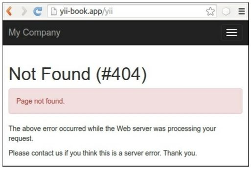
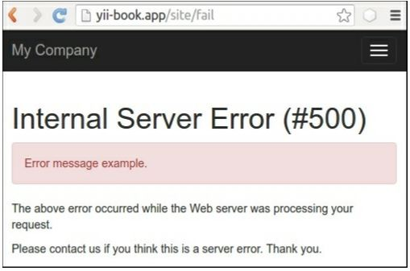
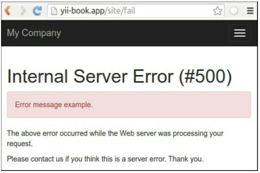

Отображение пользовательских ошибок
===
В Yii обработка ошибок очень гибкая, поэтому вы можете создать свой собственный обработчик ошибок для ошибок определенного типа. В этом рецепте, мы будем обрабатывать 404 ошибку «не нашли» . Мы покажем пользовательскую страницу 404, которая будет предлагать контент на основе того, что было введено в адресной строке.

Подготовка 
---

1 Создайте новое yii2-app-basic приложение с помощью диспетчера пакетов Composer, как описано в официальном руководстве по адресу <http://www.yiiframework.com/doc-2.0/guide-start-installation.html>. 
По русски <http://yiiframework.domain-na.me/doc/guide/2.0/ru/start-installation>

2 Добавьте действие fail в siteController:

```php
class SiteController extends Controller
{
    // ...
    public function actionFail()
    {
        throw new ServerErrorHttpException('Error message example.');
    }
}
```

3 Добавьте файл web/.htaccess со следующим содержимым:
```php
RewriteEngine on
RewriteCond %{REQUEST_FILENAME} !-f
RewriteCond %{REQUEST_FILENAME} !-d
RewriteRule . index.php
```

4 Настройте красивые URL для компонента urlManager в config/web.php файл:
```php
'components' => [
    // .
    'urlManager' => [
        'enablePrettyUrl' => true,
        'showScriptName' => false,
    ],
],
```

5 Убедитесь, что фреймворк отображает "Не найдено" исключение для URL-адресов, которые не существуют:


6 Кроме того, убедитесь, что фреймворк отображает исключение внутренней ошибки сервера для нашего actionFail:


7 Теперь мы хотим создать пользовательскую страницу для не найденной страницы. Давайте начнем с этого.

Как это сделать...
---
Теперь нам нужно изменить не найденное содержимое страницы, но оставить его как есть для других типов ошибок. Для этого выполните следующие действия:

1 Откройте класс siteController и найдите метод actions():
```php
class SiteController extends Controller
{
    // ...
    public function actions()
    {
        return [
            'error' => [
                'class' => 'yii\web\ErrorAction',
            ],
            'captcha' => [
                'class' => 'yii\captcha\CaptchaAction',
                'fixedVerifyCode' => YII_ENV_TEST ? 'testme' : null,
            ],
        ];
    }
    // ...
}
```

2 Удалите раздел ошибок по умолчанию и оставьте actions() следующим образом:
```php
class SiteController extends Controller
{
    // ...
    public function actions()
    {
        return [
            'captcha' => [
                'class' => 'yii\captcha\CaptchaAction',
                'fixedVerifyCode' => YII_ENV_TEST ? 'testme' : null,
            ],
        ];
    }
    // ...
}
```

3 Добавьте собственный метод actionError():
```php
class SiteController extends Controller
{
    // ...
    public function actionError()
    {
    }
}
```

4 Откройте исходный класс \yii\web\ErrorAction и скопируйте его содержимое действия в наш actionError () и настройте его для представления render custom error-404 для не найденной ошибки с кодом 404:
```php
// ...
use yii\base\Exception;
use yii\base\UserException;
class SiteController extends Controller
{
    // ...
    public function actionError()
    {
        if (($exception = Yii::$app->getErrorHandler()->exception)== null) {
            $exception = new HttpException(404, Yii::t('yii', 'Page not found.'));
        }
        if ($exception instanceof HttpException) {
            $code = $exception->statusCode;
        } else {
            $code = $exception->getCode();
        }
        if ($exception instanceof Exception) {
            $name = $exception->getName();
        } else {
            $name = Yii::t('yii', 'Error');
        }
        if ($code) {
            $name .= " (#$code)";
        }
        if ($exception instanceof UserException) {
            $message = $exception->getMessage();
        } else {
            $message = Yii::t('yii', 'An internal server error occurred.');
        }
        if (Yii::$app->getRequest()->getIsAjax()) {
            return "$name: $message";
        } else {
            if ($code == 404) {
                return $this->render('error-404');
            } else {
                return $this->render('error', [
                    'name' => $name,
                    'message' => $message,
                    'exception' => $exception,
                ]);
            }
        }
    }
}
```

5 Добавьте views/site/error-404.php просмотр файла с пользовательским сообщением:
```php
<?php
use yii\helpers\Html;
/* @var $this yii\web\View */
$this->title = 'Not Found!'
?>
<div class="site-error-404">
    <h1>Oops!</h1>
    <p>Sorry, but requested page not found.</p>
    <p>
        Please follow to <?= Html::a('index page', ['site/index'])?>
        to continue reading. Thank you.
    </p>
</div>
```

6 Вот и все. Теперь попробуйте перейти по несуществующему URL и посмотреть наш контент из error-404.php : 

7 Однако, на неудачу, мы должны увидеть содержимое по умолчанию от error.php:



Как это работает...
---
По умолчанию в приложении yii2-app-basic мы настраиваем errorAction для компонента errorHandler в конфигурационном файле  config/web .php как site/error Это означает, что фреймворк будет использовать этот маршрут для отображения каждого обработанного исключения:
```php
'components' => [
    'errorHandler' => [
        'errorAction' => 'site/error',
    ],
],
```
В классе SiteController мы используем встроенный автономный класс yii\web\ErrorAction, который отображает  error.php:
```php
class SiteController extends Controller
{
    // ...
    public function actions()
    {
        return [
            'error' => [
                'class' => 'yii\web\ErrorAction',
            ],
            'captcha' => [
                'class' => 'yii\captcha\CaptchaAction',
                'fixedVerifyCode' => YII_ENV_TEST ? 'testme' : null,
            ],
        ];
    }
    // ...
}
```
Если мы хотим переопределить его реализацию, мы можем заменить его во встроенном методе actionError() нашим собственным пользовательским содержимым.
В этом рецепте мы добавляем собственный оператор if для отображения определенного представления на основе кода ошибки:
```php
if ($code == 404) {
    return $this->render('error-404');
} else {
    return $this->render('error', [
        'name' => $name,
        'message' => $message,
        'exception' => $exception,
    ]);
}
```
Также, мы можем использовать нестандартную конструкцию для не найденной страницы.

Смотрите так же
---
Чтобы узнать больше об обработке ошибок в Yii, обратитесь к
<https://www.yiiframework.com/doc/guide/2.0/en/runtime-handling-errors>
По русски <https://www.yiiframework.com/doc/guide/2.0/ru/runtime-handling-errors>.
