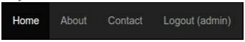
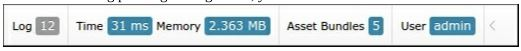
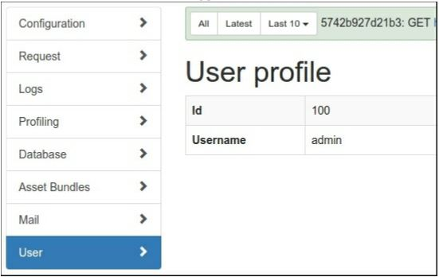

Настраиваемая панель для расширеной отладки
==
Расширение yii2-debug-это мощный инструмент для отладки собственного кода, анализа информации о запросах или запросов к базе данных и так далее. Таким образом, можно добавить собственную панель для любого пользовательского отчета.

Подготовка 
---
Создайте новое yii2-app-basic приложение с помощью диспетчера пакетов Composer, как описано в официальном руководстве по адресу <http://www.yiiframework.com/doc-2.0/guide-start-installation.html>. 
По русски <http://yiiframework.domain-na.me/doc/guide/2.0/ru/start-installation.

Как это сделать...

1 Создайте каталог панелей на корневом пути вашего сайта.

2 Добавление нового класса userPanel:

```php
<?php
namespace app\panels;
use yii\debug\Panel;
use Yii;
class UserPanel extends Panel
{
    public function getName()
    {
        return ' User ' ;
    }
    public function getSummary()
    {
        return Yii::$app->view->render('@app/panels/views/summary', ['panel' =>$this]);
    }
    public function getDetail()
    {
        return Yii::$app->view->render('@app/panels/views/detail', ['panel' =>$this]);
    }
    public function save()
    {
        $user = Yii::$app->user;
        return !$user->isGuest ? [
            'id' => $user->id,
            'username' => $user->identity->username,
        ] : null;
    }
}
```

3 Создайте panels/view/summary.php со следующим кодом:
```php
<?php
/* @var $panel app\panels\UserPanel */
use yii\helpers\Html;
?>
<div class="yii-debug-toolbar	block">
    <?php if (!empty($panel->data)): ?>
        <a href="<?= $panel->getUrl() ?>">
            User
            <span class="yii-debug-toolbarlabel yii-debug- toolbarlabel_info">
                <?= Html::encode($panel->data['username']) ?>
            </span>
        </a>
    <?php else: ?>
        <a href="<?= $panel->getUrl() ?>">Guest session</a>
    <?php endif; ?>
</div>
```

4 Добавьте panels/view/detail.php со следующим кодом:
```php
<?php
/* @var $panel app\panels\UserPanel */
use yii\widgets\DetailView;
?>
<h1>User profile</h1>
<?php if (!empty($panel->data)): ?>
    <?= DetailView::widget([
        'model' => $panel->data,
        'attributes' => [
            'id',
            'username',
        ]
    ]) ?>
<?php else: ?>
    <p>Guest session.</p>
<?php endif;?>
```

5 Включите панель инструментов в файл config/web.php:
```php
if (YII_ENV_DEV) {
    $config['bootstrap'][] = 'debug';
    $config['modules']['debug'] = [
        'class' => 'yii\debug\Module',
        'panels' => [
            'views' => ['class' => 'app\panels\UserPanel'],
        ],
    ];
    $config['bootstrap'][] = 'gii';
    $config['modules']['gii'] = 'yii\gii\Module';
}
```

6 Перезагрузите страницу index и найдите ячейку Guest Session в конце панели отладки:


7 Войдите на свой сайт с именем администратора и паролем администратора. В случае успеха вы должны увидеть свое имя пользователя в главном меню:



8 Снова наблюдайте за панелью отладки. Прямо сейчас, вы увидите имя пользователя admin : 



9 Вы можете нажать на имя пользователя на панели отладки и увидеть подробную информацию о пользователе:



Как это работает...
---
Чтобы создать собственную панель для модуля yii2-debug, необходимо расширить класс yii\debug\Panel и переопределить его шаблонные методы:

* getName ():Метка для пункта меню на странице сведений об отладке
* getsummary():Код ячейки панели отладки
* getDetail():Код представления страницы сведений
* save ():Ваша информация, которая будет сохранена в отладочном хранилище и загружена обратно в поле $panel ->data

Объект может хранить любые отладочные данные и отображать их в блоке сводка панели и на странице сведений.В нашем примере мы храним информацию о пользователях:
```php
public function save()
{
    $user = Yii::$app->user;
    return !$user->isGuest ? [
        'id' => $user->id,
        'username' => $user->identity->username,
    ] : null;
}
```
Отобразите его на страницах сводки и сведений из поля $panel - >data.

***Обработка событий***

Вы можете подписаться на любые события приложения или любого компонента в методе init (). Например, встроенная панель yii\debug\panels\MailPanel собирает и хранит все отправленные сообщения:
```php
class MailPanel extends Panel
{
    private $_messages = [];
    public function init()
    {
        parent::init();
        Event::on(
            BaseMailer::className(),
            BaseMailer::EVENT_AFTER_SEND,
            function ($event) {
                $message = $event->message;
                $messageData = [
                    // ...
                ];
            $this->_messages[] = $messageData;
            }
        );
    }
    // ...
    public function save()
    {
        return $this->_messages;
    }
}
```
Кроме того, он отображает сетку со списком сохраненных сообщений на нашей собственной странице деталей.

Смотрите так же
---
* Чтобы узнать больше о расширении yii2-debug, обратитесь к
 <https://www.yiiframework.com/doc-2.0/ext-debug-index.html> 
* Дополнительные сведения о создании панели счетчиков представлений см. в разделе
* <https://github.com/yiisoft/yii2-debug/blob/master/docs/guide/topics-creating-your-own-panels.md>
